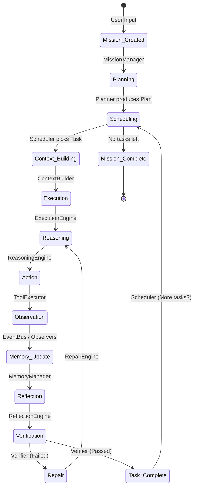

# Agent Runtime Protocol (ISA)

This document serves as the **Instruction Set Architecture (ISA)** for the AI Agent Framework. It defines the exact contracts, object transitions, invariants, and ownership boundaries across the entire lifecycle of an agent execution. 

By defining this protocol, any component (Planner, ExecutionEngine, ReflectionEngine) can be safely rewritten or swapped as long as it adheres to these contracts.

---

## The Core Protocol Sequence

---

## State Transition Contracts

### 1. `Mission Created` → `Planning`
- **Owner**: `MissionManager`
- **Consumes**: `UserDirective` (string), `SessionID`
- **Produces**: `Mission` (Initialized with `PENDING` goals)
- **Invariants**: 
  - A `Mission` must have a unique UUID.
  - `RuntimeMetrics` and `Budgets` (Time, Tokens, Max Turns) are initialized and attached.

### 2. `Planning` → `Scheduling`
- **Owner**: `PlanningEngine`
- **Consumes**: `Mission`, `RepositorySnapshot` (Current codebase state)
- **Produces**: `Plan` (Contains `Objectives`, `ExpectedEvidence`, `ExitConditions`)
- **Invariants**: 
  - The `Plan` must trace every task back to a `Goal`.
  - Planner may NOT execute tools modifying the system.

### 3. `Scheduling` → `Context Building`
- **Owner**: `TaskScheduler`
- **Consumes**: `Plan`, `AgentStateStore`
- **Produces**: `Task` (The active task to execute)
- **Invariants**: 
  - The `Task` must not be blocked by dependencies.
  - The `Task` must be assigned a `Capability` (e.g., `v1.ArchitectureSkill`) via the `CapabilityRegistry`.

### 4. `Context Building` → `Execution`
- **Owner**: `ContextBuilder`
- **Consumes**: `Task`, `WorkingMemory`, `KnowledgeGraph`, `RepositorySnapshot`
- **Produces**: `ExecutionContext` (Immutable snapshot containing `ReasoningContext`, `Budgets`, `ToolPolicies`)
- **Invariants**: 
  - The `ExecutionContext` must fit within the LLM context window.
  - Context size must be calculated and recorded.

### 5. `Execution` → `Reasoning`
- **Owner**: `ExecutionEngine` (specifically the `TurnManager`)
- **Consumes**: `ExecutionContext`
- **Produces**: `ReasoningSession` (Initialized)
- **Invariants**: 
  - `ExecutionEngine` must enforce `Budgets`. If budgets are exceeded, transition immediately to `Failed`.

### 6. `Reasoning` → `Action`
- **Owner**: `ReasoningEngine`
- **Consumes**: `ReasoningSession`, `MessageHistory`
- **Produces**: `Hypothesis`, `Decision` (Tool to call or Final Answer)
- **Invariants**: 
  - Every `Decision` must be backed by a `Hypothesis` or stated `Confidence`.
  - The chosen tool must not violate the `ToolPolicy` attached to the `ExecutionContext`.

### 7. `Action` → `Observation`
- **Owner**: `ToolRouter` & `ToolExecutor`
- **Consumes**: `Decision` (Tool call payload)
- **Produces**: `ToolInvocation` (Input, Output, Latency, Status), `Artifact` (If file generated)
- **Invariants**: 
  - Emits strongly-typed `ToolFinishedEvent` via `EventBus`.
  - Tools are sandboxed where appropriate.

### 8. `Observation` → `Memory Update`
- **Owner**: `EventBus` Subscribers (e.g., `MemoryManager`)
- **Consumes**: `ToolFinishedEvent`, `ToolInvocation`
- **Produces**: `Observation` (Source, Summary, Evidence, Importance)
- **Invariants**: 
  - Observations update the `KnowledgeGraph` by asserting `Edges` with explicit `Confidence` scores.
  - `WorkingMemory` questions transition lifecycle (`OPEN` → `ANSWERED` or `INVALIDATED`).

### 9. `Memory Update` → `Reflection`
- **Owner**: `ReflectionEngine`
- **Consumes**: `Observation`, `WorkingMemory`, `ReasoningSession`
- **Produces**: `ReflectionState` (Are we stuck? Did we learn what we needed?)
- **Invariants**: 
  - If `ReflectionEngine` determines the `Hypothesis` was false, it updates `ReasoningSession` and forces a loop back to `Reasoning`.
  - If `ReflectionEngine` determines `ExitConditions` are met, it triggers `Verification`.

### 10. `Reflection` → `Verification`
- **Owner**: `Verifier`
- **Consumes**: `Task.ExpectedEvidence`, `WorkingMemory`
- **Produces**: `VerificationResult` (Pass/Fail)
- **Invariants**: 
  - `Verifier` is not allowed to generate code or modify state; it only queries existing `KnowledgeGraph` and `Memory`.

### 11. `Verification` → `Repair` (If Failed)
- **Owner**: `RepairEngine`
- **Consumes**: `VerificationResult.FailureReason`
- **Produces**: `RepairPlan` (Appended to `ExecutionContext`)
- **Invariants**: 
  - Increments `RuntimeMetrics.retry_count`.
  - If `retry_count` > `Budgets.max_retries`, task fails.

### 12. `Verification` → `Task Complete` (If Passed)
- **Owner**: `TaskScheduler`
- **Consumes**: `VerificationResult`
- **Produces**: `Task.Status = COMPLETED`
- **Invariants**: 
  - Flushes `WorkingMemory` into `LongTermMemory` or `KnowledgeGraph`.
  - Asks `Plan` for the next available `Task`.

---

## Extensibility Guarantees

By adhering to this protocol:
1. **New LLMs**: You can swap models without touching anything outside the `ReasoningEngine`.
2. **New Skills**: You can register a new capability in `CapabilityRegistry` without changing the `ContextBuilder` or `Scheduler`.
3. **New Memory Backends**: You can swap `KnowledgeGraph` from in-memory to Neo4j without changing the `Verifier`, provided the `Observation` contract holds.
