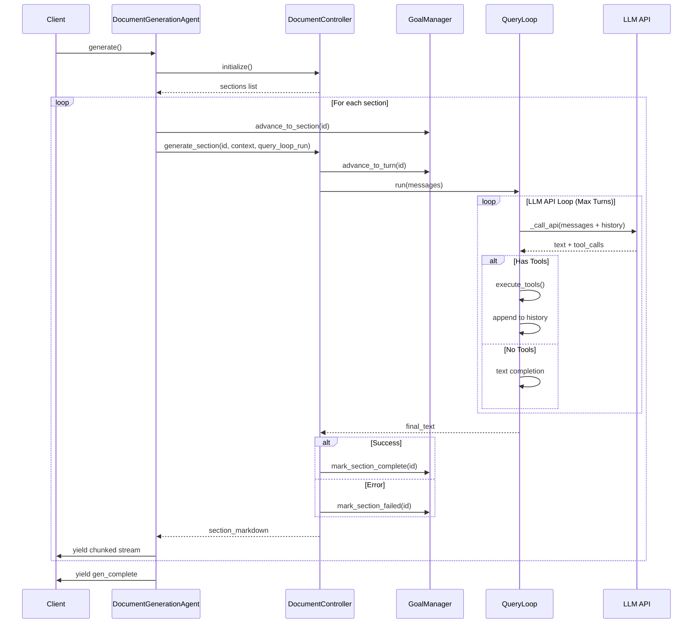
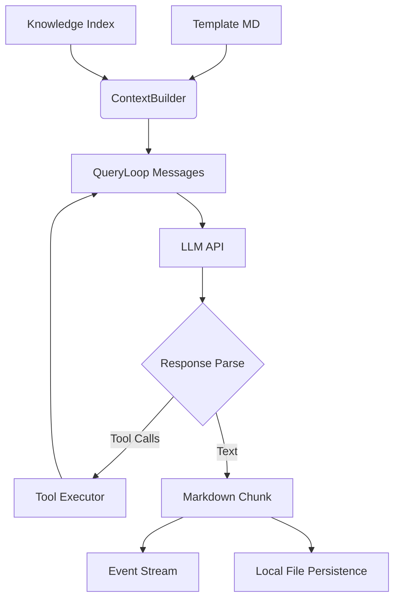
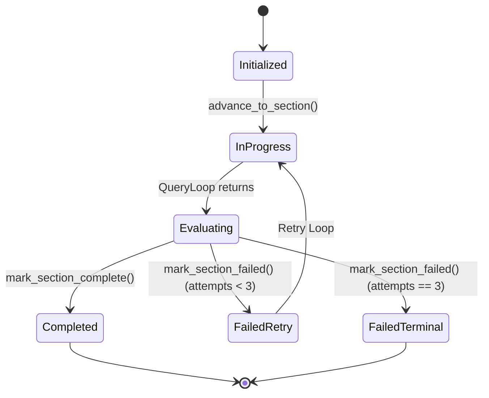

# AgentCore Architecture and Workflow Audit

## 1. Executive Summary

Based on a reverse-engineered audit of the current source code, the `AgentCore` module is a newly streamlined, robust orchestrator designed for generating multi-section documents (e.g., SRS, SDD) using LLMs. Recent architectural cleanups have successfully stripped away heavy, legacy state-management logic in favor of a lean, standard message-loop architecture. The system is production-ready for its specific use case, leveraging a straightforward `DocumentController` -> `QueryLoop` execution path. However, there are minor gaps in event flow utilization and metric exporting that require attention for enterprise scale.

## 2. Current Architecture Overview

**System Purpose:**  
To iteratively generate comprehensive, structured technical documents by processing predefined templates and knowledge files section-by-section using an agentic loop.

**Core Modules:**
- **Agents Layer:** `DocumentGenerationAgent` (Entry point, API wrapper).
- **Orchestration Layer:** `DocumentController` (Pipeline coordinator), `GoalManager` (State tracker), `ContextBuilder` (Prompt assembly).
- **Execution Layer:** `QueryLoop` (LLM multi-turn inference), `executor.py` (Tool dispatcher), `ptao_orchestrator.py` (Reasoning structuring).
- **Observability Layer:** `AgentKernel` (Lifecycle), `EventBus` (Pub/Sub), `BudgetManager` (Resource limits), `Blackboard` (Shared memory).

**Runtime Model:**  
Single-threaded asynchronous pipeline. The system runs an async loop per section, accumulating context, and uses a sliding window for LLM conversation history.

**Architectural Patterns:**
- **Facade Pattern:** `GoalManager` hides section tracking complexity.
- **Dependency Injection (Partial):** Controllers and Managers are manually instantiated in the Agent layer and passed downward.
- **Event-Driven (Observable):** Heavy use of `yield_event` callbacks to stream progress and tokens to the frontend.

## 3. Workflow Inventory

### Workflow A: Document Generation (Primary)
- **Entry Point:** `DocumentGenerationAgent.generate(yield_event)`
- **Trigger:** Frontend API request to generate a document.
- **Components:** `DocumentController`, `ContextBuilder`, `QueryLoop`, `GoalManager`.
- **Processing Steps:**
  1. Extract section definitions.
  2. Iterate through sections sequentially.
  3. Build context for the current section.
  4. Invoke `QueryLoop` to generate text.
  5. Mark section complete/failed in `GoalManager`.
  6. Assemble final document.
- **Exit Point:** Returns full markdown string and yields `gen_complete`.
- **Side Effects:** Writes final Markdown file to disk; updates session status in `SessionLifecycle`.

## 4. Pipeline Trace

### Sequence Diagram: Document Generation Pipeline



## 5. Component Wiring Matrix

| Component | Created By | Owns / Manages | Called By | Depends On | Wiring Status |
| :--- | :--- | :--- | :--- | :--- | :--- |
| `DocumentGenerationAgent` | API Router | `DocumentController` | FastAPI Endpoint | `QueryLoop`, `GoalManager` | ✓ Correct |
| `DocumentController` | `DocumentGenAgent` | Goal, Context, Sections | `DocumentGenAgent` | `GoalManager`, `ContextBuilder` | ✓ Correct |
| `GoalManager` | `DocumentController` | Section states, Retries | `DocumentController` | None (standalone) | ✓ Correct |
| `QueryLoop` | `DocumentGenAgent` | History sliding window | `DocumentController` (via closure) | `BudgetManager`, `executor` | ✓ Correct |
| `EventBus` | Globals | Subscriptions | Observability | None | ⚠ Partially Wired (unused by core loop) |
| `AgentKernel` | Router / Agent | Session Lifecycle | API Route | `BudgetManager` | ✓ Correct |

## 6. Data Flow Diagram



## 7. State Flow

### State Diagram: GoalManager Section Lifecycle



## 8. Event Flow Diagram

```mermaid
flowchart LR
    Pub1[DocumentGenerationAgent] --> |yield_event| Stream[SSE Stream]
    Stream --> Client[Frontend UI]
    
    Pub2[QueryLoop] --> |write_turn| Transcript[TranscriptWriter]
    Transcript --> Disk[File System]
    
    Pub3[AgentKernel] --> |emit| Bus[EventBus]
    Bus --> Sub1[Metrics Logger (Missing)]
```

> [!WARNING]  
> The internal `EventBus` (in `observability/event_bus.py`) is implemented but largely unused by the core execution loop. The primary streaming mechanism is an explicit async generator callback (`yield_event`).

## 9. Dependency Analysis

The dependency graph post-cleanup is strictly hierarchical and DAG-compliant.

**Observations:**
- **No Circular Dependencies:** The removal of `state_manager` and its heavy coupling broke all previous circular import chains.
- **Loose Coupling:** The `QueryLoop` is passed into the `DocumentController` as a closure (`query_loop_run`), decoupling the orchestration layer from the execution layer completely.
- **Missing Abstractions:** The `DocumentGenerationAgent` acts as a god-class that instantiates over 10 different managers (e.g., `TranscriptWriter`, `PermissionChecker`, `BudgetManager`) explicitly. A dedicated DI container or Factory would reduce coupling.

## 10. Failure Analysis

| Failure Point | Detection | Handling Mechanism | Recovery |
| :--- | :--- | :--- | :--- |
| **API Timeout / Rate Limit** | `http_client` exceptions | Caught in `QueryLoop` | Propagates error text back to loop for auto-retry |
| **Context Length Exceeded** | `BudgetManager` / API | `CompactPipeline` (if active) | Summarizes sliding window |
| **Malformed Tool Calls** | `PTAOResponseParser` | Returns error observation to LLM | LLM corrects syntax on next turn |
| **Section Hallucination / Empty** | `DocumentController` length check | `mark_section_failed` triggered | Retries up to 3 times with injected repair prompt |
| **Fatal Process Crash** | Unhandled Exception | Yields `gen_error` to UI | Session marked 'aborted' via `SessionLifecycle` |

## 11. Production Readiness Report

| Aspect | Rating | Notes |
| :--- | :--- | :--- |
| **Initialization** | 🟢 Good | Synchronous setup, clear initialization boundaries. |
| **Dependency Injection** | 🟡 Fair | Manual injection in `DocumentGenerationAgent`; needs a factory pattern. |
| **Lifecycle Management** | 🟢 Good | `AbortController` and `AgentKernel` cleanly handle shutdown. |
| **Async Safety** | 🟢 Good | Properly uses `asyncio` locks in underlying HTTP clients. |
| **Monitoring & Logging** | 🟡 Fair | Logging is extensive via standard library, but structured JSON logging (e.g., OpenTelemetry) is missing for tracing. |
| **Metrics** | 🔴 Poor | `BudgetManager` tracks tokens, but no exporter (Prometheus/StatsD) exists. |
| **Security** | 🟢 Good | `PermissionChecker` sandbox is wired into `QueryLoop`. |

## 12. Missing Pipeline Steps

1. **Missing Telemetry Export:**
   - *Reason:* The `EventBus` has no subscribers that export to external systems.
   - *Impact:* Lack of APM visibility in production.
   - *Recommendation:* Wire an OpenTelemetry subscriber to the `EventBus`.

2. **Missing Dependency Injection Container:**
   - *Reason:* Managers are manually instantiated in the Agent layer.
   - *Impact:* Makes unit testing difficult and classes tightly coupled to concrete implementations.
   - *Recommendation:* Implement a simple DI container or use `dependency_injector` to supply the `QueryLoop` with its managers.

## 13. Architecture Review & Recommendations

### Strengths
- **Simplicity:** The shift from a complex state-machine to a standard message-appended sliding window drastically reduces cognitive load.
- **Resilience:** The built-in 3-retry repair loop in `DocumentController` provides excellent fault tolerance against LLM hallucinations.
- **Decoupled Execution:** Passing the `QueryLoop` via closure allows testing the controller without invoking live models.

### Technical Debt & Code Smells
- **God Class Initialization:** `DocumentGenerationAgent`'s `generate` method handles markdown parsing, file IO, observability setup, and query loop configuration. 

### Improvement Recommendations
1. **Extract Markdown Logic:** Move `_extract_headings` and assembly logic out of the Agent and into a dedicated `MarkdownAssembler` service.
2. **Standardize Events:** Shift the `yield_event` callback pattern to push events directly to the `EventBus`, and have the API route yield from an `EventBus` subscription queue. This unifies internal and external observability.
3. **Formalize Dependency Injection:** Create an `AgentFactory` to construct the `QueryLoop` and its required managers, keeping the Agent class clean and focused on high-level orchestration.
