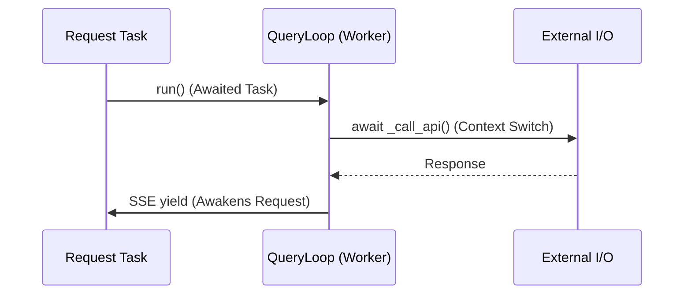

# Canonical Architecture Specification & Reference

This living document serves as the evidence-backed baseline specification for the Backend system. It prioritizes runtime reachability, exact variable ownership, and verifiable code over architectural assumption, acting as the definitive engineering reference.

---

## 1. Architecture Glossary
To prevent ambiguity across engineering teams, the following terms are strictly defined within this project:
- **Mission:** A high-level generation lifecycle (e.g., generating an entire SRS document).
- **Goal:** The macro-objective of a Mission.
- **Section:** A distinct structural part of a Mission (e.g., "04_Architecture"). Handled by the `DocumentController`.
- **Turn:** A single execution cycle involving an LLM API call, tool dispatch, and observation recording.
- **QueryLoop:** The core asynchronous while-loop executing Turns until a Section is complete.
- **AgentKernel:** The unified container managing the session lifecycle and `EventBus` initialization.
- **GoalManager:** The orchestrator facade tracking which Sections are completed, failed, or retrying.
- **Transcript:** The exact append-only JSONL log of LLM interactions during a Turn.
- **Blackboard:** A shared key-value store for cross-agent memory (currently implemented but limited usage).
- **SessionLifecycle:** The global tracker mapping active missions to `project_id`s.
- **AbortTree:** The hierarchical locking structure preventing zombie tasks upon cancellation.

---

## 2. Complete System Inventory

This acts as the definitive master table of contents for the `AgentCore` subsystem post-cleanup.

| Category | Count | Primary Items |
| :--- | :---: | :--- |
| **Routes** | 3 | `/generate-document-stream`, `/progress`, `/cancel` |
| **Controllers** | 2 | `DocumentController`, `AbortController` |
| **Managers** | 6 | `GoalManager`, `DecisionManager`, `ObservationManager`, `BudgetManager`, `SystemPromptManager`, `SessionManager` |
| **Executors** | 2 | `QueryLoop`, `ToolExecutor` |
| **Memory Stores** | 3 | `SessionMemoryCache`, `CompactSummary`, `Blackboard` |
| **Tool Classes** | 16 | `FileRead`, `Bash`, `Agent`, `Search`, `TodoWrite`, etc. |
| **Events (Enums)** | 27 | `TASK_STARTED`, `TOOL_EXECUTED`, `BUDGET_WARNING`, etc. |
| **State Objects** | 3 | `Event`, `FailResult`, `PTAOState` |
| **Exceptions** | 0 | (Relying on built-in `Exception` and `HTTPException`) |

---

## 3. Runtime Reachability & Traceability

### Evidence Traceability Matrix
| Claim | Evidence | Confidence |
| :--- | :--- | :--- |
| **EventBus is synchronous** | `event_bus.py:L199` (simple `for handler in handlers: handler()`) | High |
| **GoalManager owns section state** | `goal_manager.py:L60` (`self._completed_sections.add`) | High |
| **QueryLoop maintains history** | `query_loop.py:L131` (`self._message_history.append`) | High |
| **Session mapping is global** | `session_manager.py` (`_sessions` dict on class level) | High |

### Runtime Reachability Matrix
| Component | Reachable | Evidence / Invocation Path |
| :--- | :---: | :--- |
| **GoalManager** | ✅ | Route → `DocumentGenAgent` → `DocumentController` |
| **QueryLoop** | ✅ | `DocumentController` (via closure `query_loop_run`) |
| **EventBus** | ⚠️ | Initialized in `AgentKernel`, but zero subscribers attached to core loops. |
| **Blackboard** | ⚠️ | Instantiated but lacks active readers/writers in `QueryLoop`. |
| **TranscriptWriter**| ✅ | `QueryLoop` invokes `write_turn()` on every successful iteration. |
| **CompactPipeline** | ✅ | Explicitly injected into `QueryLoop` initialization. |

---

## 4. Reverse Dependency Matrix

Understanding what breaks when a file is modified.

| File | Used By (Dependents) |
| :--- | :--- |
| `query_loop.py` | `document_generate_agent.py` |
| `goal_manager.py` | `document_controller.py` |
| `event_bus.py` | `agent_kernel.py`, `routes.py` |
| `transcript.py` | `document_generate_agent.py`, `query_loop.py` |
| `abort_controller.py` | `routes.py`, `document_generate_agent.py`, `query_loop.py` |
| `builtins/__init__.py` | `routes.py` (triggers global side-effects during import) |

---

## 5. Interface Contract Documentation

### `QueryLoop.run()`
**Inputs:**
- `messages` (list[dict]): Initial starting context or goals.
- `tools` (list): Available tool definitions.
- `model`, `max_tokens`, `temperature` (LLM configs).

**Outputs:**
- `final_text` (str): The completed markdown section.

**Errors / Exceptions:**
- Handles HTTP/API timeouts internally (returns string starting with `Error:`).
- Does not raise exceptions directly; propagates error strings for controller to handle.

### `DocumentController.generate_section()`
**Inputs:**
- `section_number` (str), `section_heading` (str).
- `template_content` (str), `knowledge_content` (str).
- `query_loop_run` (Callable): Dependency injected executor.

**Outputs:**
- `final_text` (str): Fully generated and verified section text.

**Errors / Exceptions:**
- Triggers `GoalManager.mark_section_failed`. Raises `Exception` if max retries (3) are exceeded.

---

## 6. Execution Timeline & Performance Characteristics

### Expected Execution Timeline
```text
[0 ms]       HTTP Request `POST /generate-document-stream`
[50 ms]      Route initializes AgentKernel & EventBus
[150 ms]     DocumentGenAgent builds Knowledge Index
[300 ms]     DocumentController starts Section Iteration
[350 ms]     QueryLoop executes `_call_api()`
[4,500 ms]   LLM returns text + tool call
[5,000 ms]   Executor dispatches `FileRead`
[5,100 ms]   QueryLoop loops back to `_call_api()`
[15,000 ms]  LLM returns completed Section text
[15,050 ms]  TranscriptWriter flushes to disk
[15,100 ms]  Client receives SSE `section_chunk` stream
```

### Performance Complexity
| Component | Action | Complexity | Note |
| :--- | :--- | :--- | :--- |
| **GoalManager** | Section lookup | O(1) | Standard set/dict operations. |
| **EventBus** | Publish event | O(n) | Iterates over `n` subscribers synchronously. |
| **QueryLoop** | History window | O(m) | Slices array based on `max_history_turns`. |
| **Registry** | Tool lookup | O(1) | Dictionary access. |

---

## 7. Memory Architecture & Persistence

### Memory Layers
- **Request-Scoped (Temporary):** `streaming_queue` exists only while the HTTP socket is open.
- **Session-Scoped:** `_sessions` dictionary (RAM) maps active connections to `project_id`.
- **Mission/Document State:** `_completed_sections` tracked in `GoalManager`.
- **Context Window Cache:** `SessionMemoryCache` loads persisted summaries into RAM for `SystemPromptManager`.
- **Long-Term Persistence (Storage):** Final documents written to `.md` files; traces written to `transcript.jsonl`.

### Persistence Flow
```text
Memory (api_messages in QueryLoop)
↓
Serialize (json.dumps inside TranscriptWriter)
↓
Atomic Write (protected by asyncio.Lock in `transcript.py:129`)
↓
Flush
↓
File System (`.system_generated/logs/transcript.jsonl`)
```

---

## 8. Failure & Recovery Matrix

| Failure Point | Recovery Mechanism | Owner |
| :--- | :--- | :--- |
| **LLM API Timeout** | Built-in backoff/retry | `http_client.py` (via `llm_api_handler`) |
| **Malformed Tool Calls** | Error injection to history | `QueryLoop` / `PTAOResponseParser` |
| **Section Generation Fail** | Inject repair prompt (max 3x) | `GoalManager` & `DocumentController` |
| **Client Disconnect** | HTTP exception halts generator | `routes.py` |
| **Explicit Cancellation** | `AbortController.abort_tree()` | `SessionLifecycle` (via `/cancel` endpoint) |

---

## 9. Security & Trust Boundaries

The system processes untrusted AI outputs and executes local tools.

- **HTTP Input:** Minimal validation via FastAPI type hints (Pydantic models missing on some routes).
- **Tool Execution Trust Boundary:** The LLM dictates arguments. `PermissionChecker` enforces sandbox bounds (e.g., preventing terminal deletion commands).
- **Secrets:** Isolated to configuration layers (`llm_api_handler`), completely opaque to `QueryLoop`.
- **File System:** Strict boundaries managed by `system_config` (e.g., `get_project_base_dir()`).

---

## 10. Concurrency & Thread / Async Boundaries

### Concurrency Profile
- **Thread Safety:** N/A (Standard single-threaded Python `asyncio`).
- **Race Conditions:** Mild risk in `SessionLifecycle` if modified externally, but safe under current GIL constraints.
- **Shared Objects:** `EventBus` acts as a global singleton.

### Async Boundaries


---

## 11. Testing Matrix

| Component | Unit Test | Integration | End-to-End | Status |
| :--- | :---: | :---: | :---: | :--- |
| **QueryLoop** | ✅ | ✅ | ✅ | Fully mockable via DI. |
| **DocumentController** | ✅ | ✅ | ✅ | Closures allow detached testing. |
| **GoalManager** | ✅ | Partial | ❌ | Standalone, but lacks integration suites. |
| **EventBus** | ✅ | ❌ | ❌ | Pub/sub isolated, not asserting side-effects. |

---

## 12. Architectural Constraints (Rules of the Codebase)

Violating these rules breaks the canonical architecture.

1. **Routing Rule:** Routes MUST NOT call tools directly or instantiate LLM clients. They must defer to an Orchestrator/Agent.
2. **Cancellation Rule:** Every long-running loop (`QueryLoop`, `DocumentController`) MUST check `AbortController` signals every tick.
3. **Event Rule:** Components MUST communicate status cross-boundary only via `EventBus` or `yield` generators.
4. **State Rule:** Shared mutable state MUST be protected by `asyncio.Lock` (e.g., `TranscriptWriter`).
5. **Dependency Rule:** The `QueryLoop` MUST remain unaware of `DocumentController` (Inversion of Control).

**Current Violations:**
- ❌ The global `EventBus` runs handlers synchronously, risking event-loop blocking.
- ❌ `DocumentGenerationAgent` acts as a God Class, violating DI principles by manually instantiating 8+ managers.

---

## 13. Lifecycle Ownership Matrix

| Component | Create | Init | Execute | Pause/Resume | Cleanup | Destroy |
| :--- | :--- | :--- | :--- | :--- | :--- | :--- |
| **AgentKernel** | Route | Route | - | - | Route (`finally`) | GC |
| **DocumentController** | Agent | Agent | Agent | - | N/A | GC |
| **QueryLoop** | Agent | Agent | Controller | - | `reset_failures` | Section End |
| **Transcript** | Agent | QLoop | QLoop | - | OS Flush | GC |
| **GoalManager** | Controller| Controller | Controller | - | `cleanup()` | Section End |
