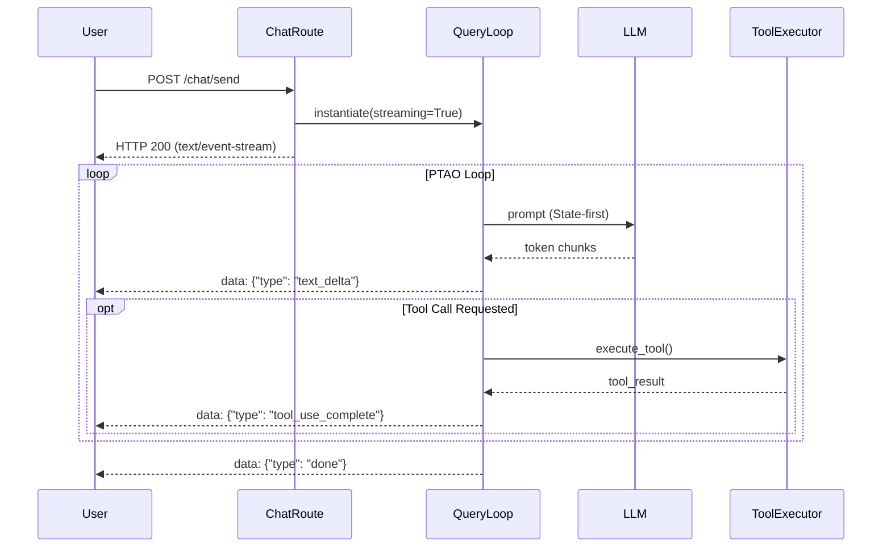
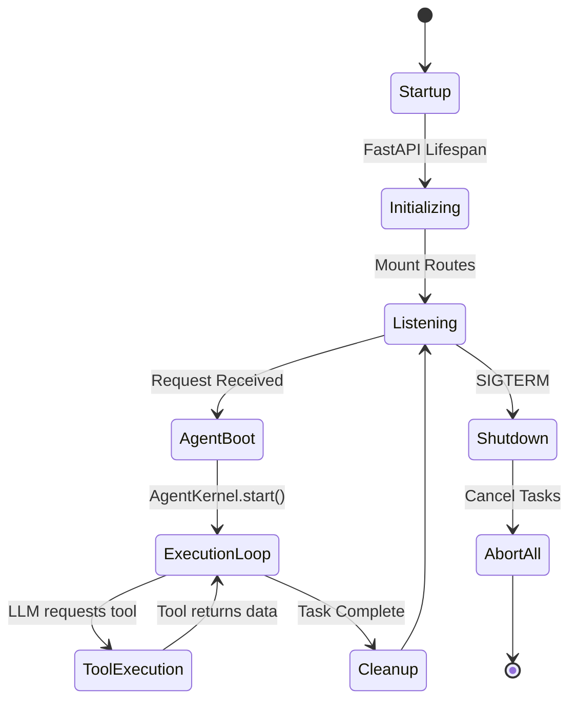
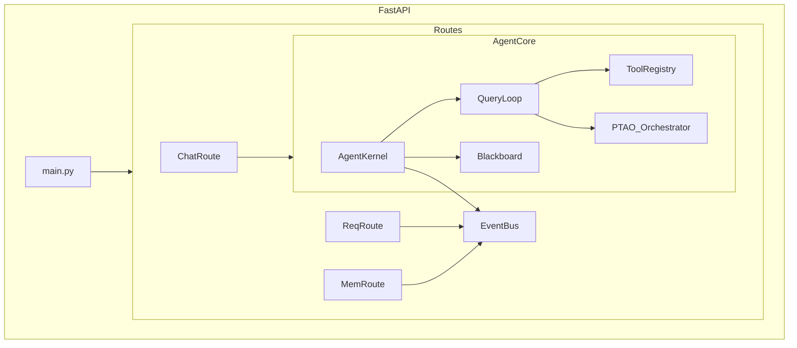

# ArchTech AI — Developer Understanding Guide

Welcome to the ArchTech AI Backend. This guide is designed to onboard new engineers by providing a complete, bottom-up and top-down mental model of the system. 

> [!NOTE]
> **Source of Truth**  
> This document was generated based on a comprehensive architectural audit of the `V5_1` codebase. It supersedes older partial documents.

---

## 1. Executive Summary

**What problem this project solves:**
ArchTech AI is an agentic software architecture platform. It automates the extraction of software requirements from uploaded source files (PDFs/Images), enriches them using cross-project knowledge (memory), and dynamically generates detailed technical documents, architecture plans, and codebase templates using a multi-agent LLM orchestrator.

**Overall Architecture:**
The system is a Python-based FastAPI backend powered by a custom agentic runtime called `AgentCore`. It follows a **reactive, state-first agent architecture** inspired by advanced runtimes like Claude Code (CCB). The backend is split into two layers:
1. **The API Routing Layer:** Handles HTTP requests, file uploads, and lightweight tasks (e.g., requirement extraction).
2. **The AgentCore Runtime:** A heavy, stateful, multi-turn execution loop (PTAO: Plan, Thought, Action, Observation) that handles complex reasoning tasks like document generation and interactive chat.

---

## 2. Architecture Overview

### Technology Stack
- **Web Framework:** FastAPI (Uvicorn)
- **Agent Orchestration:** Custom `AgentCore` (PTAO, QueryLoop)
- **LLM Integration:** AsyncOpenAI (with custom backoff/fallback routing)
- **State & Memory:** Local File System (JSON/JSONL/Markdown) in `.Archtech/`
- **Concurrency:** `asyncio` with global `AbortController` and `TaskStore`
- **Event Driven:** In-memory `EventBus`

### Key Design Decisions
1. **State-First Inference:** The LLM context window is bounded. Instead of appending to a massive conversation array, the system extracts state (`Blackboard`, `SessionMemory`) every turn and rebuilds a fresh prompt from the current state.
2. **Global Event Bus:** Cross-module communication (e.g., when requirements are extracted, memory is generated) happens via a singleton `EventBus` (`MEMORY_UPDATED`), decoupling the API routes from the Agent runtime.
3. **Graceful Cancellation:** An `AbortHierarchy` tied to FastAPI's `lifespan` hook ensures that runaway LLM loops are cleanly killed via `SIGTERM`.

### Architecture Strengths
- Highly observable agent loops (Streaming SSE, progress metrics).
- Strong budget controls (token limits, loop limits).
- Complete isolation of execution context (`AgentContextManager`).

### Architecture Weaknesses
- Heavy reliance on local file system locking, which limits horizontal scalability.
- `llm_api_handler.py` duplicates some API routing logic outside of `AgentCore`.

---

## 3. Folder Guide

| Folder | Purpose & Responsibilities |
| :--- | :--- |
| **`AgentCore/`** | **The Brain.** Contains the core multi-agent orchestration runtime. It is entirely self-contained and manages its own lifecycle, tools, memory, and LLM query loops. |
| **`Routes/`** | **The Entrypoints.** FastAPI routers mapping HTTP endpoints to backend services. Handles REST and SSE streaming (e.g., `chat_routes.py`, `requirement_extraction_routes.py`). |
| **`Requirement_extraction/`** | **The Ingestion Engine.** Dedicated module for parsing user uploads, extracting requirements via LLM, and saving them to project JSON files. |
| **`Memory_Management/`** | **The Knowledge Base.** Enriches extracted requirements into Markdown-based knowledge files, effectively building a local RAG dataset for the agents. |
| **`Template_analysis/`** | **The Blueprint Engine.** Logic for parsing structural templates that guide the `DocumentGenerationAgent` on what to write. |

---

## 4. File Guide

### Core System Files
- **`main.py`**: The FastAPI application root. Mounts all routers and manages the `lifespan` context (startup/shutdown, `abort_all()`).
- **`system_config.py`**: Centralized configuration management. Resolves `.env` variables and provides path getters for the `.Archtech/` data directory.
- **`llm_api_handler.py`**: The base LLM API client. Provides `llm_request` with exponential backoff, retry-on-empty, and auto-correction. (Used primarily by lightweight API routes).

### AgentCore Files
- **`AgentCore/execution/query_loop.py`**: The main multi-turn inference loop. Implements the State-First architecture.
- **`AgentCore/execution/ptao_orchestrator.py`**: Handles parsing LLM responses into structured Plan, Thought, Action, Observation blocks.
- **`AgentCore/observability/agent_kernel.py`**: The runtime environment for an agent. Owns the `EventBus`, `Blackboard`, and `BudgetManager`.
- **`AgentCore/agents/document_generate_agent.py`**: A specialized agent that consumes a template and writes a document section by section.
- **`AgentCore/execution/session_manager.py`**: Manages session lifecycles, PID files, and transcript history for UI resumption.

---

## 5. Class Guide

### `AgentKernel` (`agent_kernel.py`)
- **Purpose**: The sandbox/runtime environment for an agent execution.
- **Lifecycle**: Created by a Route/Spawner -> `start()` -> Runs -> `cleanup()`.
- **State**: `INITIALIZING`, `RUNNING`, `PAUSED`, `CANCELLED`, `COMPLETE`.
- **Dependencies**: `EventBus`, `Blackboard`, `BudgetManager`.

### `QueryLoop` (`query_loop.py`)
- **Purpose**: The while-true loop that interacts with the LLM.
- **Methods**: `run()` (async). Builds context -> Calls API -> Executes Tools -> Updates State -> Repeats.
- **Owner**: Usually instantiated by a specific Agent (like `DocumentGenerationAgent`) or directly by a streaming route.

### `EventBus` (`event_bus.py`)
- **Purpose**: In-memory pub/sub for decoupling components.
- **State**: A dictionary mapping `EventType` to lists of subscriber callbacks.
- **Important**: The global instance `get_global_bus()` is used to wire FastAPI background tasks to the AgentCore.

---

## 6. Function Guide

### `llm_request` (`llm_api_handler.py`)
- **Purpose**: Execute an LLM call with resilience.
- **Inputs**: `model`, `messages`, `max_tokens`, `fallback_chain`.
- **Side Effects**: Sleeps on rate limits/timeouts.
- **Complexity**: High. Implements 3 levels of fallback and JSON auto-correction.

### `abort_all` (`abort_controller.py`)
- **Purpose**: Instantly cancel all running background agent tasks.
- **Execution Order**: Triggered by `main.py` lifespan shutdown -> marks global signal `is_aborted=True` -> cancels all pending `asyncio.Task` in `TaskStore`.

---

## 7. Request Flows (Sequence Diagrams)

### Chat Streaming Flow (`/chat/send`)

---

## 8. Feature Walkthroughs

### Feature: Requirement Extraction & Memory Enrichment
**Purpose**: Turn raw uploads into structured agent knowledge.
1. User calls `/upload-requirements`. `requirement_extraction_routes.py` saves files.
2. Background extraction runs, parses text, and saves `requirements.json`.
3. User selects requirements and calls `/submit-selected`.
4. Route saves selection and fires `EventBus.publish(MEMORY_UPDATED)`.
5. User calls `/generate-memory`. `MemoryManagementAgent` runs in background, enriching requirements into markdown files.
6. Upon completion, it fires `EventBus.publish(MEMORY_UPDATED)`.

---

## 9. Runtime Lifecycle

---

## 10. State Management

- **Agent Internal State**: Managed by `StateManager` inside `AgentCore`. It bounds context windows by extracting observations rather than appending chat logs.
- **Session History**: Persisted in `.Archtech/<project_id>/projects/` as JSONL transcripts. Handled by `SessionLifecycle`.
- **Global Memory**: Markdown files in `.Archtech/<project_id>/knowledge/`. Acted upon as a pseudo-database for RAG.
- **Concurrency**: State is localized to `AgentContext` threads to prevent race conditions during concurrent API requests.

---

## 11. Dependency & Ownership Graphs

**Ownership Rules**:
- `main.py` owns the `AbortHierarchy`.
- `AgentKernel` owns the specific agent lifecycle.
- `QueryLoop` owns the token budget and context generation.

---

## 12. Debugging Guide

- **Agent Loops Spinning Out of Control?** 
  - *Breakpoint*: `QueryLoop.run()` inside the `for _ in range(self.max_turns):` loop.
  - *Check*: Is the LLM generating a tool call that errors repeatedly? The retry logic might be trapped.
- **Changes not reflecting in context?**
  - *Breakpoint*: `ContextBuilder.build_from_state_only()`.
  - *Check*: Ensure the `ObservationExtractor` successfully mapped the LLM output into the `StateManager`.
- **Zombie Background Tasks?**
  - *Log Check*: Grep for `[TaskStore]` or `[AbortController]`. Ensure `task.add_done_callback` is correctly discarding tasks.

---

## 13. Change Impact Matrix

| File | Risk Level | If Modified, Check... |
| :--- | :--- | :--- |
| `query_loop.py` | **CRITICAL** | Entire agentic behavior. Can cause infinite loops or proxy timeouts if context building is broken. |
| `agent_kernel.py` | **HIGH** | State machine transitions. Modifying lifecycle states will break observability UI. |
| `event_bus.py` | **MEDIUM** | Ensure no recursive event publishing (Event A triggers Event B triggers Event A). |
| `main.py` | **HIGH** | Startup/Shutdown hooks. Breaking this leaks threads on server restart. |

---

## 14. Development Guide

### How to Add a New Tool
1. Create a function in `AgentCore/tools/`.
2. Decorate it with `@register(name="my_tool", description="...")`.
3. Add type hints (they are parsed into JSON schema automatically).
4. The tool is automatically discovered by `ToolRegistry`.

### How to Add a New Route
1. Create `Routes/my_new_route.py`.
2. Define an `APIRouter()`.
3. Go to `main.py` and add `app.include_router(my_new_route.router)`.
4. If it requires background LLM work, use `asyncio.create_task()` and register it with `_background_tasks` to ensure graceful shutdown.

---

## 15. Architecture Weaknesses & Technical Debt
1. **Duplicate LLM Clients**: `llm_api_handler.py` and `AgentCore.execution.streaming_api.py` both implement LLM streaming. *Recommendation: Deprecate `llm_api_handler.py` entirely in V6.*
2. **File System Locking**: Writing state to `.Archtech` relies on simple file writes. High concurrency could cause race conditions. *Recommendation: Introduce SQLite or Redis.*

---

## 16. Recommended Learning Path for New Hires

1. **Start Here**: Read `main.py` to understand how the FastAPI server boots and mounts endpoints.
2. **Understand the LLM Bridge**: Read `llm_api_handler.py` to see how the system protects against brittle LLMs (auto-correction, exponential backoff).
3. **Understand the Agent**: Read `AgentCore/execution/query_loop.py`. This is the most complex and important file in the system. Understand the "State-First" paradigm compared to standard append-only chat bots.
4. **Understand Data Flow**: Look at `Routes/requirement_extraction_routes.py` to see how files turn into JSON, and then `event_bus.py` to see how the rest of the system finds out about it.

*End of Guide*
