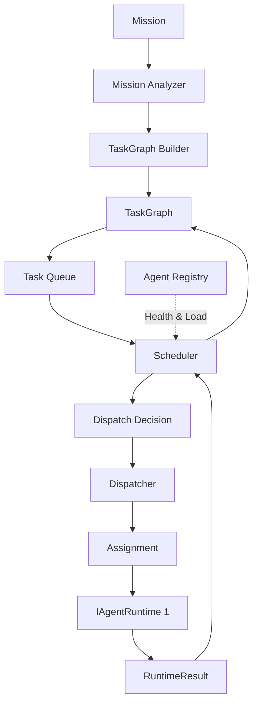

# Milestone 5: Distributed Orchestration Architecture

*Goal: Elevate the framework from a single autonomous loop into a multi-agent orchestration platform. We shift our mindset from "How does the runtime think?" to "How do runtimes cooperate?"*

## User Review Required

> [!IMPORTANT]
> I have completely refactored the Milestone 5 Architecture based on your exact feedback. 
> - Added `TaskGraph`, `MissionAnalyzer`, and `TaskGraphBuilder`.
> - Fully decoupled `TaskQueue`, `Scheduler`, and `Dispatcher`.
> - Expanded `AgentDescriptor` and introduced `Assignment` and `RuntimeResult`.
> - Reorganized into 5 clear implementation phases starting with local runtimes.
>
> Please review this final orchestration architecture. If approved, I will instantiate `task.md` and immediately begin executing **Phase 5.1**.

---

## The Core Concept

1. **The Black Box Principle**: Orchestrators communicate with workers *exclusively* via the `IAgentRuntime` interface. `LoopController`, `TurnManager`, and `ReasoningEngine` are permanently frozen.
2. **Decoupled Responsibilities**: The Queue holds the work. The Scheduler matches the work. The Dispatcher executes the work.
3. **Local First**: We will instantiate multiple local runtimes inside a single process first. True distributed networking will come later behind the stable `IAgentRuntime` abstraction.

---

## M5 Orchestration Flow

---

## Deliverables & Phases

### Phase 5.1: Contracts
Define the foundational types. Orchestration will rely entirely on these data structures.
- **`IAgentRuntime`**: The black box boundary (`execute`, `pause`, `resume`, `checkpoint`, `cancel`, `status`).
- **`RuntimeResult`**: Rich output (`task_id`, `status`, `produced_evidence`, `produced_artifacts`, `journal_reference`, `cost`, `metrics`, `checkpoint_id`, `failure_reason`).
- **`TaskContract`**: The unit of work (`goal`, `execution_context`, `policy`, `deadline`, `budget`, `expected_evidence`).
- **`AgentDescriptor`**: Worker metadata (`id`, `profile`, `capabilities`, `current_load`, `status`, `heartbeat`, `last_seen`, `health`, `versions`). 
- **`AgentStatus`**: Expanded lifecycle (`STARTING`, `READY`, `IDLE`, `BUSY`, `CHECKPOINTING`, `PAUSED`, `DRAINING`, `FAILED`, `OFFLINE`).
- **`Assignment`**: The binding contract (`assignment_id`, `worker_id`, `task_id`, `lease_expiration`, `priority`, `attempt_number`).

### Phase 5.2: Planning
Break complex missions into acyclic execution graphs.
- **`MissionAnalyzer`**: Parses the high-level intent (e.g., "Build a REST API").
- **`TaskGraphBuilder`**: Generates a DAG of `TaskContracts`.
- **`TaskGraph`**: Manages node dependencies (`dependencies`, `dependents`, `priority`, `critical_path`).

### Phase 5.3: Scheduling
Match pending work to capable workers.
- **`AgentRegistry`**: Tracks active `AgentDescriptors`.
- **`TaskQueue`**: The source of pending work.
- **`Scheduler`**: Evaluates the Queue against the Registry to produce a `DispatchDecision`.
- **`Dispatcher`**: Creates the `Assignment` and invokes the worker.

### Phase 5.4: Worker Management
Handle the operational lifecycle of the worker nodes.
- **`RuntimeWrapper`**: Implements `IAgentRuntime` by wrapping our M4.5 AgentCore.
- **`HealthMonitor`**: Pings runtimes, detects crashes, and updates the Registry.
- **`WorkerLifecycle`**: Handles recovery (Worker crashed -> HealthMonitor -> Registry -> Scheduler -> Replacement Policy -> New Worker).

### Phase 5.5: Mission Execution
The full end-to-end integration.
- Initialize `N` local runtimes.
- Submit a multi-step Mission.
- Observe Planner generating the TaskGraph, Scheduler dispatching tasks concurrently, and Results flowing back to resolve dependencies.
