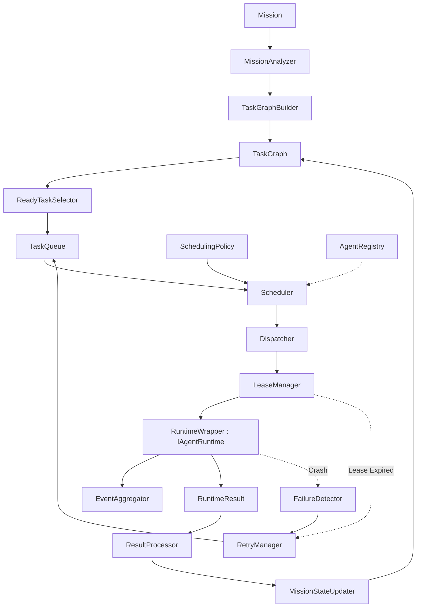

# Milestone 5: Distributed Orchestration Architecture

*Goal: Elevate the framework from a single autonomous loop into a multi-agent orchestration platform using enterprise-grade distributed systems patterns (borrowing from Kubernetes schedulers and microservice architectures).*

## User Review Required

> [!IMPORTANT]
> I have completely refactored the Milestone 5 Architecture based on your final deep-dive review.
> - Separated into 5 explicit layers (Mission, Scheduling, Worker, Runtime, Result).
> - Added `ReadyTaskSelector`, `LeaseManager`, `RetryManager`, `MissionStateManager`, and `EventAggregator`.
> - Separated Static (`AgentDescriptor`) and Dynamic (`AgentHeartbeat`) registry state.
> - Split `HealthMonitor` into `HeartbeatMonitor` and `FailureDetector`.
> - Reordered implementation into 7 logic-driven phases to minimize blocking dependencies.
>
> Please give this final blueprint a review. If you approve, I will initialize the M5 task list and begin building **Phase 5.1: Contracts**.

---

## The 5-Layer Architecture

### 1. Mission Layer
Owns the high-level objective and execution graph.
- **`MissionAnalyzer`**: Parses the high-level intent into distinct phases.
- **`MissionStateManager`**: Tracks overarching progress (X tasks pending, Y running, Z completed).
- **`TaskGraphBuilder`**: Generates a DAG of `TaskContracts`.
- **`TaskGraph`**: Manages node dependencies (`dependencies`, `dependents`, `critical_path`).
- **`ReadyTaskSelector`**: Exposes only unblocked tasks to the Queue.

### 2. Scheduling Layer
Owns task allocation, queuing, and retries.
- **`TaskQueue`**: The source of pending, ready-to-execute work.
- **`Scheduler`**: The matching algorithm.
- **`SchedulingPolicy`**: Evaluates capabilities, load, cost, deadline, and affinity.
- **`Dispatcher`**: Maps the decision to a worker node.
- **`LeaseManager`**: Grants a time-bound lease (`Task20 -> Worker5 -> 10m`). If the lease expires before completion, the task is released.
- **`RetryManager`**: Intercepts failures, increments attempt counters, applies backoff, and requeues.

### 3. Worker Layer
Owns the lifecycle and health of the agent nodes.
- **`AgentRegistry`**: Tracks available workers.
- **`AgentDescriptor`**: Static metadata (`id`, `profile`, `capabilities`, `resource_limits`).
- **`AgentHeartbeat`**: Dynamic state (`cpu`, `memory`, `queue_depth`, `health`).
- **`RuntimeWrapper`**: Implements the black-box `IAgentRuntime` interface wrapping M4.5 code.
- **`WorkerLifecycle`**: Transitions (`SPAWN`, `READY`, `BUSY`, `DRAIN`, `CHECKPOINT`, `SHUTDOWN`, `RETIRE`).
- **`HeartbeatMonitor`**: Pings workers for liveness.
- **`FailureDetector`**: Detects OOMs, deadlocks, stalled checkpoints, or missed heartbeats.

### 4. Runtime Layer (FROZEN)
Owns the tactical execution of a single task.
- **`IAgentRuntime`**: The boundary interface.
- *(M4.5 Frozen Internals: LoopController, TurnManager, ReasoningEngine, etc.)*

### 5. Result Layer
Owns telemetry aggregation and graph resolution.
- **`ResultProcessor`**: Receives `RuntimeResult`, parsing success/failure.
- **`MissionStateUpdater`**: Updates `MissionStateManager` and unblocks dependents in the `TaskGraph`.
- **`EventAggregator`**: Rolls up hundreds of granular runtime events (Decisions, Observations) into a single orchestration-level `TaskCompleted` event.
- **`ExecutionJournal` & `Telemetry`**: Historical data stores for M6 Learning.

---

## Orchestration Flow

---

## Implementation Sequence (M5)

We build bottom-up to minimize blocking dependencies.

1. **Phase 5.1: Contracts**: Define the foundational types (`IAgentRuntime`, `RuntimeResult`, `TaskContract`, `AgentDescriptor`, `AgentHeartbeat`, `Assignment`).
2. **Phase 5.2: Runtime Wrapper**: Wrap the M4.5 AgentCore behind `IAgentRuntime` to create local worker targets.
3. **Phase 5.3: Agent Registry & Lifecycle**: Build `AgentRegistry`, `WorkerLifecycle`, `HeartbeatMonitor`, and `FailureDetector`.
4. **Phase 5.4: Queue & Dispatch**: Build `TaskQueue`, `Dispatcher`, `LeaseManager`, and `RetryManager`.
5. **Phase 5.5: Scheduler**: Build the `Scheduler` and `SchedulingPolicy`.
6. **Phase 5.6: Planner & State**: Build `MissionAnalyzer`, `TaskGraphBuilder`, `TaskGraph`, `MissionStateManager`, and `ResultProcessor`.
7. **Phase 5.7: Integration**: Execute an end-to-end multi-task mission across 3 local runtime instances.
