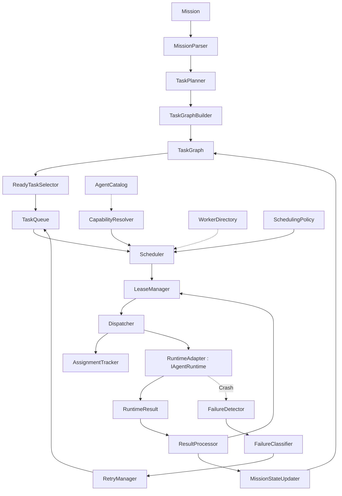

# Milestone 5: Distributed Orchestration Architecture (FROZEN)

*Goal: Elevate the framework from a single autonomous loop into a multi-agent orchestration platform using enterprise-grade distributed systems patterns.*

## The 5-Layer Architecture

### 1. Mission Layer
Owns the high-level objective and execution graph.
- **`MissionParser`**: Parses the raw user request/mission.
- **`MissionSpecification`**: The structured output of the parser.
- **`TaskPlanner`**: Decides the actual work required to satisfy the specification.
- **`TaskGraphBuilder`**: Generates a DAG of `TaskContracts` based on the planner.
- **`TaskGraph`**: Manages node dependencies (`dependencies`, `dependents`, `critical_path`).
- **`MissionStateManager`**: Tracks overarching progress (X tasks pending, Y running, Z completed).
- **`ReadyTaskSelector`**: Exposes only unblocked tasks to the Queue.

### 2. Scheduling Layer
Owns task allocation, queuing, and retries.
- **`TaskQueue`**: The source of pending, ready-to-execute work.
- **`CapabilityResolver`**: Answers "Who can execute Bash? Who has GPU?" to narrow eligible workers.
- **`Scheduler`**: The matching algorithm selecting the best worker from the eligible pool.
- **`SchedulingPolicy`**: Evaluates capabilities, load, cost, deadline, and affinity.
- **`LeaseManager`**: Grants a time-bound lease (`Task20 -> Worker5 -> 10m`) **before** dispatching.
- **`Dispatcher`**: Maps the decision to a worker node and executes the `IAgentRuntime`.
- **`AssignmentTracker`**: Preserves task-to-worker history across retries for telemetry and debugging.
- **`RetryManager`**: Receives classified failures, increments attempt counters, applies backoff, and requeues.

### 3. Worker Layer
Owns the lifecycle and health of the agent nodes.
- **`AgentCatalog`**: Static metadata (`id`, `profile`, `capabilities`, `resource_limits`, `versions`).
- **`WorkerDirectory`**: Dynamic state (`heartbeat`, `cpu`, `memory`, `queue_depth`, `health`, `lease`).
- **`RuntimeAdapter`**: Implements the black-box `IAgentRuntime` interface wrapping M4.5 code.
- **`WorkerLifecycle`**: Transitions (`SPAWN`, `READY`, `BUSY`, `DRAIN`, `CHECKPOINT`, `SHUTDOWN`, `RETIRE`).
- **`HeartbeatMonitor`**: Pings workers for liveness.
- **`FailureDetector`**: Detects OOMs, deadlocks, stalled checkpoints, or missed heartbeats, routing them to the `FailureClassifier`.

### 4. Runtime Layer (FROZEN)
Owns the tactical execution of a single task.
- **`IAgentRuntime`**: The boundary interface.
- *(M4.5 Frozen Internals: LoopController, TurnManager, ReasoningEngine, FailureClassifier etc.)*

### 5. Result Layer
Owns telemetry aggregation and graph resolution.
- **`ResultProcessor`**: Receives `RuntimeResult`, releases the lease via `LeaseManager`, and parses success/failure.
- **`MissionStateUpdater`**: Updates `MissionStateManager` and unblocks dependents in the `TaskGraph`.
- **`EventAggregator`**: Rolls up granular runtime events into orchestration-level `TaskCompleted` events.
- **`ExecutionJournal` & `Telemetry`**: Passive historical data sources for M6 Learning.

---

## Orchestration Flow

---

## Implementation Sequence (M5)

1. **Phase 5.1: Contracts**: `IAgentRuntime`, `RuntimeResult`, `TaskContract`, `AgentDescriptor`, `AgentHeartbeat`, `Assignment`.
2. **Phase 5.2: Runtime Adapter**: Wrap M4.5 AgentCore behind `IAgentRuntime`.
3. **Phase 5.3: Worker Management**: `AgentCatalog`, `WorkerDirectory`, `HeartbeatMonitor`, `FailureDetector`, `WorkerLifecycle`.
4. **Phase 5.4: Queue & Dispatch**: `TaskQueue`, `LeaseManager`, `Dispatcher`, `AssignmentTracker`, `RetryManager`.
5. **Phase 5.5: Scheduling**: `CapabilityResolver`, `Scheduler`, `SchedulingPolicy`.
6. **Phase 5.6: Mission Layer**: `MissionParser`, `TaskPlanner`, `TaskGraphBuilder`, `TaskGraph`, `MissionStateManager`, `ReadyTaskSelector`.
7. **Phase 5.7: Result Layer**: `ResultProcessor`, `MissionStateUpdater`, `EventAggregator`.
8. **Phase 5.8: Integration**: E2E multi-task execution across local runtimes.
