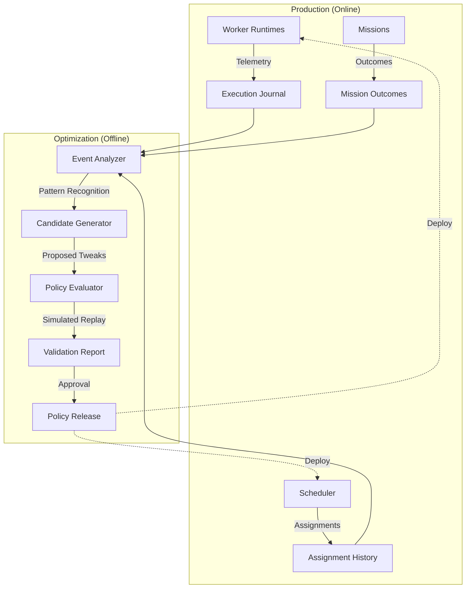

# Milestones 5.5 & 6: Hardening & Learning

*Goal: Elevate the framework from "enterprise-ready architecture" to "production-grade proven" through rigorous operational validation (M5.5), and implement a secure, offline learning pipeline (M6) that uses historical telemetry to optimize behavior without self-modifying execution.*

## User Review Required

> [!IMPORTANT]
> Based on your final verdict, the core architecture is now locked. I have mapped out the transition to production-readiness in M5.5 and the offline learning pipeline in M6.
> 
> Please review this final roadmap sequence. If approved, I will instantiate `task.md` and begin the M5.5 Operational Validation phase.

---

## Milestone 5.5: Operational Validation (Chaos & Scale)

Architecture is theoretical until tested under duress. M5.5 introduces chaos engineering and load testing specifically targeting the distributed orchestration boundaries.

### Validation Domains

1. **Concurrent Load & Throughput**
   - Execute 100+ concurrent multi-task missions.
   - Measure scheduler latency, queue throughput, and memory footprint scaling.
2. **Chaos Recovery (Fault Injection)**
   - Simulate worker process termination (`SIGKILL`) during active execution.
   - Verify `LeaseManager` correctly expires the lease and `RetryManager` requeues the task to a new worker.
3. **Partition Tolerance**
   - Simulate network partition (missing heartbeats) from active workers.
   - Verify `FailureDetector` routes to `FailureClassifier` and gracefully drains or re-assigns.
4. **Idempotency & Reassignment**
   - Verify that tasks terminated mid-execution and re-assigned do not cause duplicate/corrupted side-effects (leveraging M4.5 memory invariants).
5. **Rolling Upgrades**
   - Simulate a registry holding workers with mixed `RuntimeVersion` and `ContractVersion`.
   - Verify the `CapabilityResolver` maps tasks strictly to compatible versions.

---

## Milestone 6: Offline Learning & Optimization

M6 implements a continuous improvement pipeline. Crucially, learning happens **offline** and is deployed as immutable policy releases. The runtime *never* self-modifies during execution.

### The Learning Pipeline

### Components

1. **`EventAnalyzer`**: Ingests the passive data stores (`ExecutionJournal`, `AssignmentHistory`, `Telemetry`). Identifies bottlenecks (e.g., "Worker Profile X fails 40% of the time on Task Y").
2. **`CandidateGenerator`**: Proposes changes to `SchedulingPolicy`, capability requirements, or runtime `PolicyManager` rules.
3. **`PolicyEvaluator`**: Validates proposed changes by running them against the `ReplayEngine` (from M4.5) using historical checkpoints to ensure no regressions.
4. **`PolicyRelease`**: Packages the validated improvements into a static configuration deployment.

### M6 Deliverables
- Implementation of the `OfflineLearningPipeline`.
- Creation of the `PolicyEvaluator` using M4.5 Replay loops.
- Demonstration of a full cycle: *Detecting a failure trend -> Generating a policy fix -> Simulating the fix -> Releasing the updated policy configuration.*
