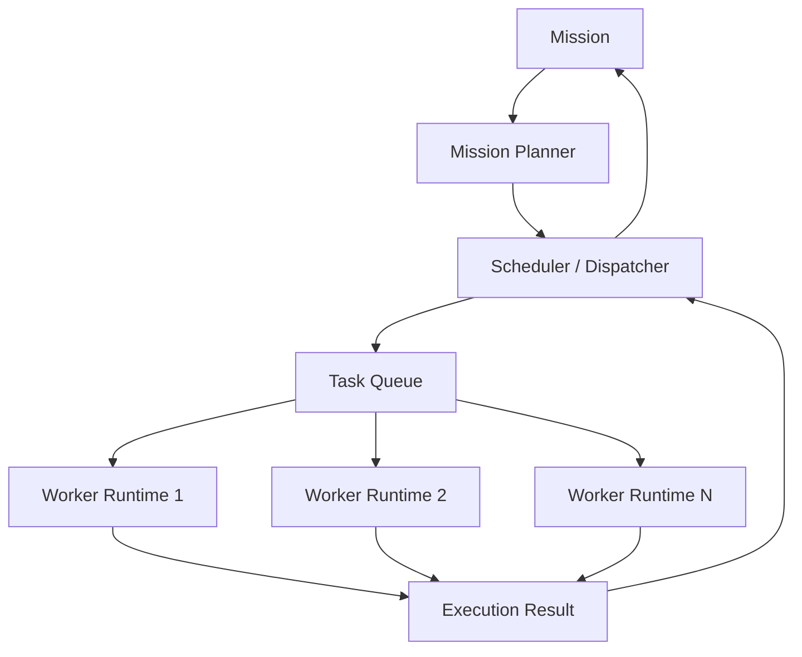

# Milestone 5: Distributed Orchestration Architecture

*Goal: Elevate the framework from a single autonomous loop into a distributed, multi-agent orchestration platform. We shift our mindset from "How does the runtime think?" to "How do runtimes cooperate?"*

## User Review Required

> [!IMPORTANT]
> The single-agent runtime is now officially frozen behind `IAgentRuntime`. 
> I have mapped out the M5 Architecture strictly based on your definitions of `AgentDescriptor`, `TaskContract`, and the `Mission -> Planner -> Scheduler` flow. 
> 
> Please review this orchestration architecture. If approved, I will instantiate `task.md` and begin implementing the contracts and the Supervisor logic.

---

## Architectural Constraints

1. **The Black Box Principle**: Orchestrators will communicate with agents *exclusively* via the `IAgentRuntime` interface. `LoopController`, `TurnManager`, and `ReasoningEngine` are internal implementation details and are strictly off-limits to the orchestrator.
2. **Interchangeable Workers**: Tasks are routed based on capabilities, load, and availability, not hardcoded logic.
3. **Fault Isolation**: If a worker runtime crashes, it is the Scheduler's job to catch the crash, invoke a runtime replacement, and re-enqueue the `TaskContract` without failing the parent Mission.

---

## Proposed Contracts

### 1. `IAgentRuntime`
The only interface the orchestration layer knows about.
```python
class IAgentRuntime(Protocol):
    async def execute(self, task: TaskContract) -> RuntimeResult: ...
    async def pause(self) -> None: ...
    async def resume(self) -> None: ...
    async def checkpoint(self) -> str: ...
    async def cancel(self) -> None: ...
    async def status(self) -> RuntimeStatus: ...
```

### 2. `AgentDescriptor`
The metadata registry used by the Scheduler to intelligently route tasks.
```python
@dataclass
class AgentDescriptor:
    agent_id: str
    profile: str               # e.g., "Senior Python Engineer", "QA Tester"
    capabilities: List[str]    # e.g., ["bash", "file_edit", "code_review"]
    current_load: int
    status: AgentStatus        # IDLE, BUSY, PAUSED, OFFLINE
    supported_skills: List[str]
    resource_limits: dict
```

### 3. `TaskContract`
Replaces raw "prompts". A strongly-typed payload passed to workers.
```python
@dataclass
class TaskContract:
    task_id: str
    goal: str
    execution_context: dict    # Read-only repo states or dependencies
    policy: RuntimePolicy      # Budgets and bounds assigned to this specific task
    deadline_ms: int
    expected_evidence: str     # What the worker must return to prove completion
```

---

## Orchestration Flow

We are replacing the M4 `Mission -> WorkflowRunner` with a true distributed pipeline:



1. **Mission Planner**: Breaks a high-level mission into an acyclic graph of `TaskContracts`.
2. **Scheduler**: Evaluates `AgentDescriptors` to find the most capable, idle worker.
3. **Queue**: Handles backpressure if all workers of a specific profile are busy.
4. **Worker Runtime**: An instantiation of the frozen M4.5 runtime, executing behind the `IAgentRuntime` wall.
5. **Result Aggregation**: Results flow back up to the Scheduler, which triggers dependent downstream tasks.

---

## Implementation Sequence (M5)

1. **Define Core Contracts**: Create `orchestration/contracts.py` with `IAgentRuntime`, `AgentDescriptor`, and `TaskContract`.
2. **Adapt Runtime Wrapper**: Wrap our existing AgentCore logic into an `AgentRuntimeImpl` that faithfully fulfills the `IAgentRuntime` protocol.
3. **Implement Task Queue & Registry**: Build the `AgentRegistry` to track active descriptors and the `TaskQueue` for pending contracts.
4. **Implement Scheduler**: Build the logic that maps a `TaskContract` to the optimal `AgentDescriptor`.
5. **Implement Mission Planner**: Build the layer that fractures a complex objective into sequential/parallel `TaskContracts`.
6. **Integration**: Execute a multi-agent mission (e.g., *Agent A writes code, Agent B runs tests*).
