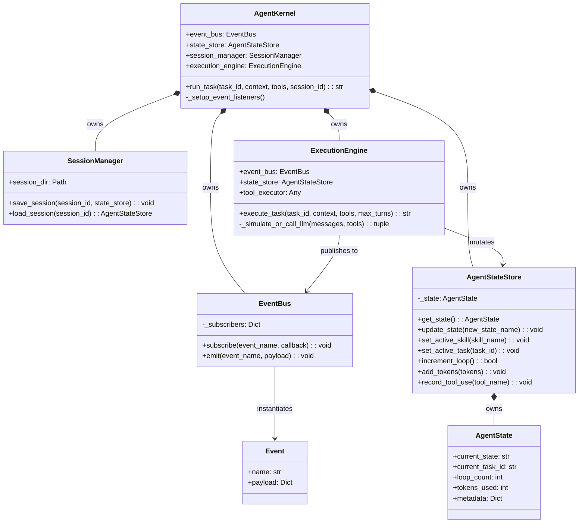

# Milestone 1: Runtime Foundation Architecture Review

This document provides a rigorous architectural evaluation of the newly implemented Agent Kernel foundation. It validates the design against the Single Responsibility Principle, analyzes dependency injection strategies, and forecasts future scaling bottlenecks.

---

## 1. Class Diagram



---

## 2. Call Sequence: `AgentKernel.run_task()`

```mermaid
sequenceDiagram
    participant Client
    participant Kernel as AgentKernel
    participant Session as SessionManager
    participant State as AgentStateStore
    participant Engine as ExecutionEngine
    participant LLM as LLM API
    participant Tools as ToolExecutor
    participant Bus as EventBus

    Client->>Kernel: run_task(task_id, context)
    Kernel->>Session: load_session(session_id)
    Session-->>Kernel: AgentStateStore (or None)
    Kernel->>State: update_state("EXECUTE")
    
    Kernel->>Engine: execute_task(task_id, context)
    activate Engine
    
    loop Max Turns
        Engine->>State: increment_loop()
        Engine->>Bus: emit("TurnStarted")
        
        Engine->>LLM: _simulate_or_call_llm(messages)
        LLM-->>Engine: Tool Calls / Text
        Engine->>State: add_tokens(amount)
        
        opt If Tool Calls exist
            loop For each Tool
                Engine->>Bus: emit("ToolStarted")
                Engine->>State: record_tool_use(name)
                Engine->>Tools: execute(tool, input)
                Tools-->>Engine: Tool Result
                Engine->>Bus: emit("ToolFinished")
            end
        end
        
        Engine->>Bus: emit("TurnCompleted")
        
        opt If final text (No tools)
            Engine->>Bus: emit("TaskCompleted")
            break
        end
    end
    
    Engine-->>Kernel: result
    deactivate Engine
    
    Kernel->>Session: save_session(session_id, State)
    Kernel-->>Client: result
```

---

## 3. Public API Definitions

### `EventBus`
- **`subscribe(event_name: str, callback: Callable)`**: Registers an async callback to a specific event stream. Used for decoupling observers.
- **`emit(event_name: str, payload: dict)`**: Publishes an `Event` to all registered subscribers concurrently. Returns immediately.

### `AgentStateStore`
- **`get_state() -> AgentState`**: Returns the current snapshot of runtime state.
- **`update_state(new_state_name: str)`**: Transitions the high-level execution phase (e.g. `EXPLORE` -> `PLAN`).
- **`increment_loop() -> bool`**: Safely increments the turn counter. Returns False if budget is exceeded, enforcing limits.
- **`add_tokens(tokens: int)`**: Accumulates token usage for billing/budget tracking.

### `SessionManager`
- **`save_session(session_id: str, state_store: AgentStateStore)`**: Serializes current memory and state variables to disk for crash recovery.
- **`load_session(session_id: str) -> Optional[AgentStateStore]`**: Restores the `AgentStateStore` from a previous snapshot.

### `ExecutionEngine`
- **`execute_task(task_id: str, context: str, tools: list, max_turns: int) -> str`**: The runtime boundary. Enters an isolated loop, calling the LLM and firing tools until completion or budget exhaustion. Returns final string result.

### `AgentKernel`
- **`run_task(...) -> str`**: Main entry point for clients. Handles loading session, delegating to the engine, and saving state upon completion.

---

## 4. Single Responsibility Principle (SRP) Violations & God Object Risks

### Current Risks
1. **`AgentKernel` Risk**: While currently clean, `AgentKernel` risks becoming a "God Object" in Milestone 3. As we add `TaskScheduler`, `MissionManager`, and `MemoryManager`, the Kernel's `run_task` method will bloat if it tries to coordinate *how* these modules interact.
   - *Recommendation*: The Kernel should act purely as an IoC (Inversion of Control) container. It should construct the dependencies and start the `TaskScheduler`. The `TaskScheduler` should invoke the `ExecutionEngine`, not the Kernel directly.
2. **`ExecutionEngine` SRP Violation**: Currently, the engine handles LLM turning, tool execution logic, AND tracking message history context. 
   - *Recommendation*: We need a `ContextBuilder` or `MessageManager` injected into the Engine to strictly manage the sliding window of prompts, leaving the Engine to just handle the while-loop control flow.

---

## 5. Dependency Injection, Interfaces, and Extension Points

The current architecture utilizes Constructor Injection to decouple subsystems:

- `ExecutionEngine` does not instantiate `EventBus` or `AgentStateStore`; they are passed into its constructor.
- `ExecutionEngine` accepts a generic `tool_executor`. It is not tightly bound to a specific toolset implementation.

### Extension Points:
- **Event Observers**: You can attach infinite background processors (e.g., telemetry, loggers, memory updaters) without modifying core classes simply by calling `EventBus.subscribe()`.
- **State Store**: The `AgentState` is a dataclass. You can subclass or extend it to track custom metrics without altering the `SessionManager` interface.

---

## 6. Component Swappability

Because of the decoupled design, major components can be swapped effortlessly:

- **LLM Provider**: The `ExecutionEngine._simulate_or_call_llm` boundary can accept a generic `LLMProvider` interface (e.g., `AnthropicProvider`, `OpenAIProvider`). The Kernel injects the chosen provider at startup.
- **Session Store**: By abstracting `SessionManager` into an `ISessionStore` interface, we could swap the JSON-file implementation for a PostgreSQL, Redis, or SQLite implementation instantly.
- **Tool Executor**: `ExecutionEngine` only expects a `execute(tool_def, call_id, input)` contract. We can inject an `UnsandboxedBashExecutor` or a `DockerSandboxedExecutor` seamlessly.

---

## 7. Scaling Bottleneck Estimations

Classes expected to grow beyond 500-1000 lines as the framework matures:

1. **`ExecutionEngine` (>1000 lines)**
   - *Why*: Parsing malformed LLM tool calls, handling context length limits, exponential backoff/retries, and tool execution error handling will explode the size of the turn loop.
   - *Decomposition*: Extract `ToolRouter` (handles tool execution and error formatting), `MessageAssembler` (handles sliding windows and token counting), and `LLMClient` (handles API retries).
   
2. **`SessionManager` (>500 lines)**
   - *Why*: Once we add `TaskGraph`, `Mission` history, and `WorkingMemory` representations, serializing complex object trees will become difficult.
   - *Decomposition*: Implement the Repository Pattern. Create `StateRepository`, `TaskGraphRepository`, and `MemoryRepository`, letting `SessionManager` act merely as a Facade.

3. **`AgentKernel` (>800 lines)**
   - *Why*: Wiring 15 different managers (from the Milestone 4 blueprint) will make the `__init__` massive.
   - *Decomposition*: Use a Dependency Injection framework or an `AgentFactory` pattern to construct the graph outside the runtime kernel.
