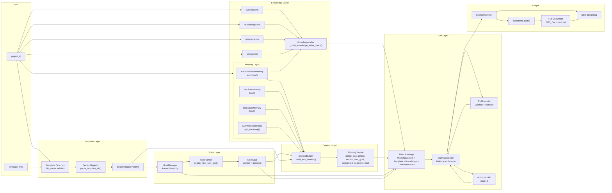
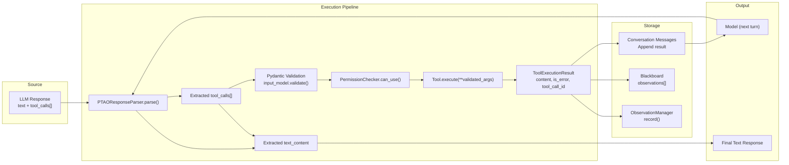
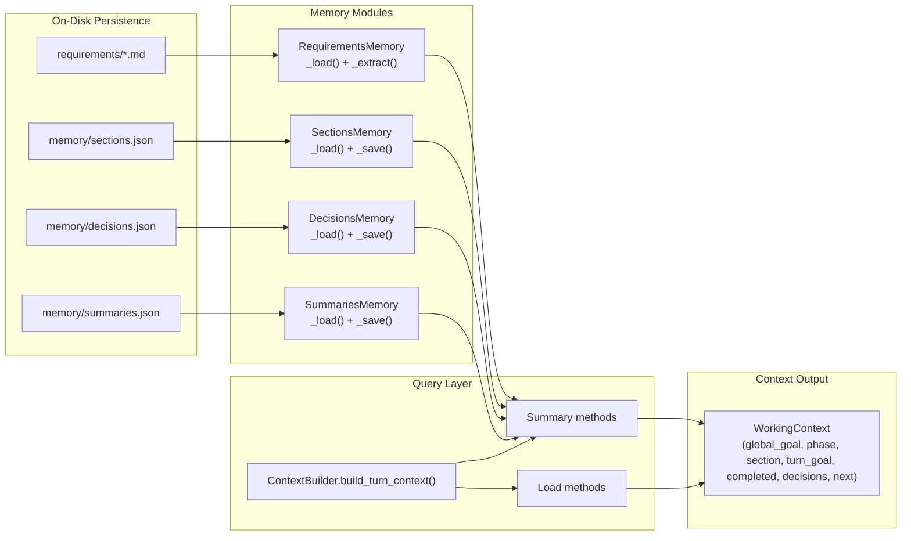

# AgentCore Data Flow Diagrams

## 1. Document Data Flow

```mermaid
flowchart LR
    subgraph Input["Input"]
        ProjectID["project_id"]
        TemplateType["template_type"]
    end

    subgraph Template["Template Layer"]
        TemplateDir["Template Directory\nNN_name.md files"]
        Registry["SectionRegistry\nparse_template_dir()"]
        Sections["SectionRegistryEntry[]"]
    end

    subgraph Knowledge["Knowledge Layer"]
        Overview["overview.md"]
        Memory["MEMORY.md"]
        Relationships["relationships.md"]
        Requirements["requirements/"]
        Categories["categories/"]
        Index["KnowledgeIndex\n_build_knowledge_index_block()"]
    end

    subgraph State["State Layer"]
        GoalMgr["GoalManager\n4-level hierarchy"]
        Planner["TaskPlanner\ndecide_next_turn_goal()"]
        NextGoal["NextGoal\nsection + objective"]
    end

    subgraph Memory["Memory Layer"]
        ReqMem["RequirementsMemory\nsummary()"]
        SecMem["SectionsMemory\nload()"]
        DecMem["DecisionsMemory\nload()"]
        SumMem["SummariesMemory\nget_summary()"]
    end

    subgraph Context["Context Layer"]
        CtxBuilder["ContextBuilder\nbuild_turn_context()"]
        WorkingCtx["WorkingContext\nglobal_goal, phase, section, turn_goal, completed, decisions, next"]
    end

    subgraph LLM["LLM Layer"]
        UserMsg["User Message\nWorkingContext + Template + Knowledge + TaskInstructions"]
        QueryLoop["QueryLoop.run()\nMulti-turn inference"]
        Tools["ToolExecutor\nValidate + Execute"]
        API["Anthropic API\nopus46"]
    end

    subgraph Output["Output"]
        SectionContent["Section Content"]
        DocumentParts["document_parts[]"]
        FullDoc["Full Document\nSRS_Document.md"]
        SSE["SSE Streaming"]
    end

    ProjectID --> TemplateDir
    TemplateType --> TemplateDir
    TemplateDir --> Registry
    Registry --> Sections

    ProjectID --> Overview
    ProjectID --> Memory
    ProjectID --> Relationships
    ProjectID --> Requirements
    ProjectID --> Categories
    Overview --> Index
    Memory --> Index
    Relationships --> Index
    Requirements --> Index
    Categories --> Index
    Index --> UserMsg

    Sections --> GoalMgr
    GoalMgr --> Planner
    Planner --> NextGoal

    NextGoal --> CtxBuilder
    Sections --> CtxBuilder
    ReqMem --> CtxBuilder
    SecMem --> CtxBuilder
    DecMem --> CtxBuilder
    SumMem --> CtxBuilder
    CtxBuilder --> WorkingCtx
    WorkingCtx --> UserMsg

    GoalMgr --> UserMsg
    NextGoal --> UserMsg

    UserMsg --> QueryLoop
    QueryLoop --> API
    API --> QueryLoop
    QueryLoop --> Tools
    Tools --> QueryLoop
    QueryLoop --> SectionContent

    SectionContent --> DocumentParts
    DocumentParts --> FullDoc
    SectionContent --> SSE
    FullDoc --> SSE
```

## 2. Tool Data Flow

```mermaid
flowchart LR
    subgraph Source["Source"]
        LLM["LLM Response\ntext + tool_calls[]"]
    end

    subgraph Execution["Execution Pipeline"]
        Parser["PTAOResponseParser.parse()"]
        Text["Extracted text_content"]
        Calls["Extracted tool_calls[]"]
        Validator["Pydantic Validation\ninput_model.validate()"]
        Permission["PermissionChecker.can_use()"]
        Executor["Tool.execute(**validated_args)"]
        Result["ToolExecutionResult\ncontent, is_error, tool_call_id"]
    end

    subgraph Storage["Storage"]
        Messages["Conversation Messages\nAppend result"]
        Blackboard["Blackboard\nobservations[]"]
        ObsMgr["ObservationManager\nrecord()"]
    end

    subgraph Output["Output"]
        Model["Model (next turn)"]
        Final["Final Text Response"]
    end

    LLM --> Parser
    Parser --> Text
    Parser --> Calls
    Calls --> Validator
    Validator --> Permission
    Permission --> Executor
    Executor --> Result
    Result --> Messages
    Result --> Blackboard
    Result --> ObsMgr

    Messages --> Model
    Model --> Parser

    Calls --> Text
    Text --> Final
```

## 3. Memory Data Flow

```mermaid
flowchart LR
    subgraph Persistence["On-Disk Persistence"]
        ReqFile["requirements/*.md"]
        SecFile["memory/sections.json"]
        DecFile["memory/decisions.json"]
        SumFile["memory/summaries.json"]
    end

    subgraph MemoryModules["Memory Modules"]
        ReqMem["RequirementsMemory\n_load() + _extract()"]
        SecMem["SectionsMemory\n_load() + _save()"]
        DecMem["DecisionsMemory\n_load() + _save()"]
        SumMem["SummariesMemory\n_load() + _save()"]
    end

    subgraph Query["Query Layer"]
        CtxBuilder["ContextBuilder.build_turn_context()"]
        Summary["Summary methods"]
        Load["Load methods"]
    end

    subgraph Context["Context Output"]
        WorkingCtx["WorkingContext\n(global_goal, phase, section, turn_goal, completed, decisions, next)"]
    end

    ReqFile --> ReqMem
    SecFile --> SecMem
    DecFile --> DecMem
    SumFile --> SumMem

    ReqMem --> Summary
    SecMem --> Summary
    DecMem --> Summary
    SumMem --> Summary

    CtxBuilder --> Summary
    CtxBuilder --> Load

    Summary --> WorkingCtx
    Load --> WorkingCtx
```

## 4. Blackboard State Flow

```mermaid
flowchart TD
    subgraph Writers["Write Owners"]
        MC["MissionController\nwrites: mission, plan, progress"]
        SCH["Scheduler\nwrites: current_task, completed_tasks"]
        QL["QueryLoop\nwrites: observations, decisions"]
        TE["ToolExecutor\nwrites: tool_results"]
        BB["Blackboard\nauto-computes: confidence, quality, coverage, risk"]
    end

    subgraph Blackboard["Blackboard State"]
        M["mission"]
        P["plan"]
        PR["progress"]
        T["current_task"]
        CT["completed_tasks"]
        O["observations"]
        D["decisions"]
        TR["tool_results"]
        C["confidence"]
        Q["quality"]
        CO["coverage"]
        R["risk"]
    end

    subgraph Readers["Read-Only Consumers"]
        CTX["ContextBuilder\nreads: completed_tasks, decisions, observations"]
        PLR["TaskPlanner\nreads: completed_tasks"]
        GOAL["GoalManager\nreads: mission, progress"]
        REC["RecoveryManager\nreads: observations, decisions"]
    end

    MC --> M
    MC --> P
    MC --> PR
    SCH --> T
    SCH --> CT
    QL --> O
    QL --> D
    TE --> TR
    BB --> C
    BB --> Q
    BB --> CO
    BB --> R

    CTX --> CT
    CTX --> D
    CTX --> O
    PLR --> CT
    GOAL --> M
    GOAL --> P
    GOAL --> PR
    REC --> O
    REC --> D
```
