# AgentCore Dependency Graph

## Architecture Overview

All dependencies flow in ONE direction — no cycles. The layered architecture ensures:

1. `observability/` has NO dependencies on any other AgentCore layer
2. `execution/` depends ONLY on `observability/` (for EventBus, Blackboard, BudgetManager)
3. `orchestration/` depends on `execution/` and `observability/`
4. `agents/` depends on everything (it's the top layer)
5. `shared/` has NO dependencies on any AgentCore layer

## Mermaid Dependency Graph

```mermaid
flowchart LR
    subgraph External["External Dependencies"]
        SysConfig["system_config\npath resolution"]
        LLM["Anthropic API"]
        FastAPI["FastAPI\nHTTP framework"]
    end

    subgraph Shared["shared/ (0 internal deps)"]
        Exceptions["exceptions.py"]
        Config["config.py"]
        Types["types.py"]
    end

    subgraph Observability["observability/ (0 internal deps)"]
        EventBus["event_bus.py"]
        Blackboard["blackboard.py"]
        BudgetManager["budget_manager.py"]
        AgentKernel["agent_kernel.py"]
        Verification["verification.py"]
    end

    subgraph Execution["execution/ (deps: shared/, observability/)"]
        QueryLoop["query_loop.py"]
        Executor["executor.py"]
        Registry["registry.py"]
        PTAO["ptao_orchestrator.py"]
        SystemPrompt["system_prompt.py"]
        Compaction["compaction.py"]
        SessionMemory["session_memory.py"]
        AgentSpawner["agent_spawner.py"]
        AbortCtrl["abort_controller.py"]
        MsgMgr["message_manager.py"]
        TokenTracker["token_tracker.py"]
        Transcript["transcript.py"]
        QueryGuard["query_guard.py"]
        Permission["permission.py"]
        Streaming["streaming_api.py"]
        ChatSessions["chat_sessions.py"]
        ContextIso["context_isolation.py"]
        AgentCleaner["agent_cleanup.py"]
        AgentMailbox["agent_mailbox.py"]
        TaskState["task_state.py"]
        SessionMgr["session_manager.py"]
        ProgressTypes["progress_types.py"]
        BuiltinTools["builtins/\n16 tool implementations"]
    end

    subgraph Orchestration["orchestration/ (deps: execution/, observability/)"]
        DocCtrl["document_controller.py"]
        SecReg["section_registry.py"]
        DepGraph["dependency_graph.py"]
        GoalMgr["goal_manager.py"]
        GoalState["goal_state.py"]
        TaskPlanner["task_planner.py"]
        NextGoal["next_goal.py"]
        CtxBuilder["context_builder.py"]
        WorkingCtx["working_context.py"]
        CompactCtx["compact_context.py"]
        Memory["memory/\n5 memory modules"]
        ObsMgr["observation_manager.py"]
        DecMgr["decision_manager.py"]
        RecMgr["recovery_manager.py"]
        SumStore["section_summary.py"]
    end

    subgraph Agents["agents/ (deps: execution/, orchestration/, observability/)"]
        DocAgent["document_generate_agent.py"]
        Routes["routes.py"]
    end

    External --> Shared
    Shared --> Observability
    Observability --> Execution
    Observability --> Orchestration
    Execution --> Orchestration
    Execution --> Agents
    Orchestration --> Agents
```

## Dependency Matrix

| Module | External Deps | Internal Deps | Depended On By |
|--------|--------------|---------------|----------------|
| `shared/exceptions.py` | stdlib | none | ALL |
| `shared/config.py` | system_config | none | execution/, orchestration/ |
| `shared/types.py` | pydantic | none | execution/builtins/ |
| `observability/event_bus.py` | stdlib | none | ALL |
| `observability/blackboard.py` | stdlib | none | orchestration/ |
| `observability/budget_manager.py` | stdlib | none | execution/ |
| `observability/agent_kernel.py` | stdlib | event_bus, blackboard, budget_manager | agents/ |
| `observability/verification.py` | stdlib | blackboard | orchestration/ |
| `execution/registry.py` | stdlib | shared/types | execution/ |
| `execution/executor.py` | stdlib | registry, permission | execution/ |
| `execution/permission.py` | stdlib | none | execution/ |
| `execution/query_guard.py` | stdlib | none | execution/ |
| `execution/token_tracker.py` | stdlib | none | execution/ |
| `execution/compaction.py` | stdlib | none | execution/ |
| `execution/ptao_orchestrator.py` | stdlib | none | execution/ |
| `execution/system_prompt.py` | stdlib | ptao_orchestrator | execution/ |
| `execution/session_memory.py` | stdlib | config | execution/ |
| `execution/transcript.py` | stdlib | config | execution/ |
| `execution/session_manager.py` | stdlib | config | execution/ |
| `execution/message_manager.py` | stdlib | none | execution/ |
| `execution/streaming_api.py` | stdlib | none | execution/ |
| `execution/chat_sessions.py` | stdlib | session_manager | execution/ |
| `execution/context_isolation.py` | stdlib | none | execution/ |
| `execution/abort_controller.py` | stdlib | context_isolation | execution/ |
| `execution/task_state.py` | stdlib | context_isolation | execution/ |
| `execution/agent_mailbox.py` | stdlib | task_state | execution/ |
| `execution/agent_cleanup.py` | stdlib | abort_controller, task_state | execution/ |
| `execution/query_loop.py` | stdlib | compaction, session_memory, system_prompt, registry, executor, ptao_orchestrator, abort_controller, message_manager, token_tracker, transcript, query_guard, permission, streaming_api, budget_manager | orchestration/ |
| `execution/agent_spawner.py` | stdlib | abort_controller, query_loop, context_isolation, message_manager, token_tracker, transcript, agent_cleanup, agent_mailbox, task_state | execution/ |
| `execution/builtins/*` | stdlib | registry, executor, session_manager, abort_controller, task_state | execution/ |
| `orchestration/section_registry.py` | stdlib | none | orchestration/ |
| `orchestration/dependency_graph.py` | stdlib | none | orchestration/ |
| `orchestration/goal_state.py` | stdlib | none | orchestration/ |
| `orchestration/goal_manager.py` | stdlib | goal_state | orchestration/ |
| `orchestration/next_goal.py` | stdlib | none | orchestration/ |
| `orchestration/task_planner.py` | stdlib | next_goal | orchestration/ |
| `orchestration/working_context.py` | stdlib | none | orchestration/ |
| `orchestration/compact_context.py` | stdlib | none | orchestration/ |
| `orchestration/observation_manager.py` | stdlib | none | orchestration/ |
| `orchestration/decision_manager.py` | stdlib | none | orchestration/ |
| `orchestration/recovery_manager.py` | stdlib | observation_manager | orchestration/ |
| `orchestration/section_summary.py` | stdlib | working_context, next_goal | orchestration/ |
| `orchestration/memory/base.py` | stdlib | none | orchestration/memory/ |
| `orchestration/memory/requirements.py` | stdlib | base | orchestration/memory/ |
| `orchestration/memory/sections.py` | stdlib | base | orchestration/memory/ |
| `orchestration/memory/decisions.py` | stdlib | base | orchestration/memory/ |
| `orchestration/memory/summaries.py` | stdlib | base | orchestration/memory/ |
| `orchestration/context_builder.py` | stdlib | working_context, next_goal, goal_state, goal_manager, memory/*, section_summary | orchestration/ |
| `orchestration/document_controller.py` | stdlib | section_registry, dependency_graph, goal_manager, task_planner, context_builder, observation_manager, decision_manager, recovery_manager, section_summary, memory/* | orchestration/ |
| `agents/document_generate_agent.py` | stdlib | document_controller, query_loop, abort_controller, session_manager | agents/ |
| `agents/routes.py` | fastapi, stdlib | document_generate_agent, abort_controller, session_lifecycle, sse_event_queue | FastAPI |
