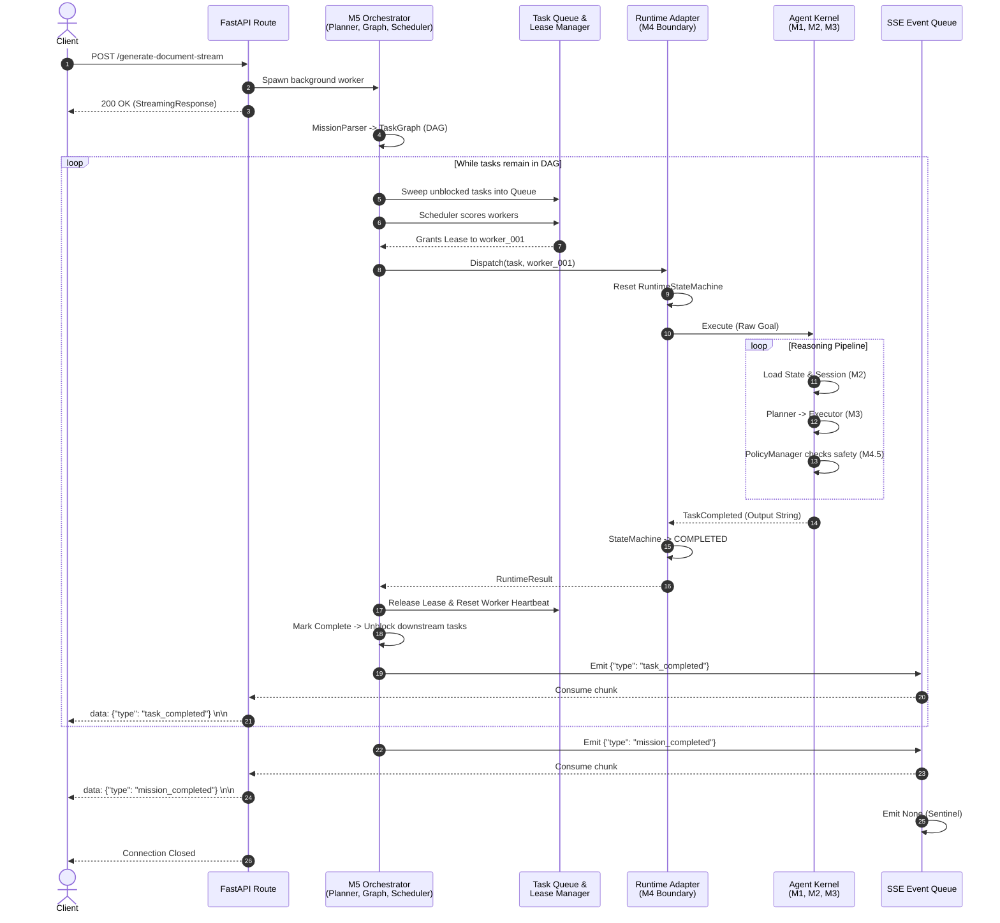

```mermaid
sequenceDiagram
    autonumber
    
    actor Client
    participant API as FastAPI Route
    participant M5_Orchestrator as M5 Orchestrator<br/>(Planner, Graph, Scheduler)
    participant Queue as Task Queue &<br/>Lease Manager
    participant M4_Adapter as Runtime Adapter<br/>(M4 Boundary)
    participant M1_Kernel as Agent Kernel<br/>(M1, M2, M3)
    participant SSE as SSE Event Queue

    Client->>API: POST /generate-document-stream
    
    %% API spawns background task and returns stream
    API->>M5_Orchestrator: Spawn background worker
    API-->>Client: 200 OK (StreamingResponse)
    
    %% Mission Planning
    M5_Orchestrator->>M5_Orchestrator: MissionParser -> TaskGraph (DAG)
    
    %% Orchestration Loop
    loop While tasks remain in DAG
        M5_Orchestrator->>Queue: Sweep unblocked tasks into Queue
        
        M5_Orchestrator->>Queue: Scheduler scores workers
        Queue-->>M5_Orchestrator: Grants Lease to worker_001
        
        M5_Orchestrator->>M4_Adapter: Dispatch(task, worker_001)
        
        %% Boundary Firewall
        M4_Adapter->>M4_Adapter: Reset RuntimeStateMachine
        M4_Adapter->>M1_Kernel: Execute (Raw Goal)
        
        %% Execution Loop
        loop Reasoning Pipeline
            M1_Kernel->>M1_Kernel: Load State & Session (M2)
            M1_Kernel->>M1_Kernel: Planner -> Executor (M3)
            M1_Kernel->>M1_Kernel: PolicyManager checks safety (M4.5)
        end
        
        M1_Kernel-->>M4_Adapter: TaskCompleted (Output String)
        M4_Adapter->>M4_Adapter: StateMachine -> COMPLETED
        
        M4_Adapter-->>M5_Orchestrator: RuntimeResult
        
        %% Cleanup and Unblock
        M5_Orchestrator->>Queue: Release Lease & Reset Worker Heartbeat
        M5_Orchestrator->>M5_Orchestrator: Mark Complete -> Unblock downstream tasks
        
        %% Real-time SSE
        M5_Orchestrator->>SSE: Emit {"type": "task_completed"}
        SSE-->>API: Consume chunk
        API-->>Client: data: {"type": "task_completed"} \n\n
    end
    
    M5_Orchestrator->>SSE: Emit {"type": "mission_completed"}
    SSE-->>API: Consume chunk
    API-->>Client: data: {"type": "mission_completed"} \n\n
    SSE->>SSE: Emit None (Sentinel)
    API-->>Client: Connection Closed
```