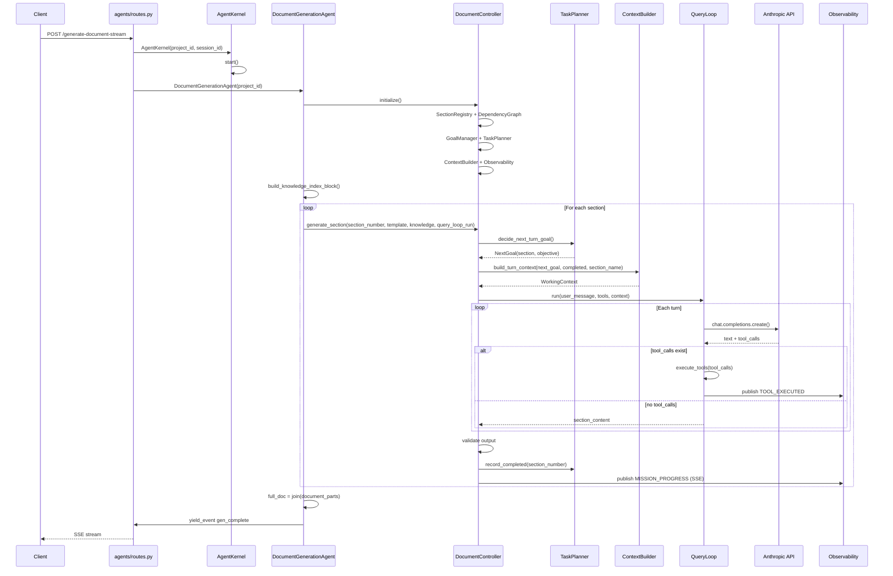
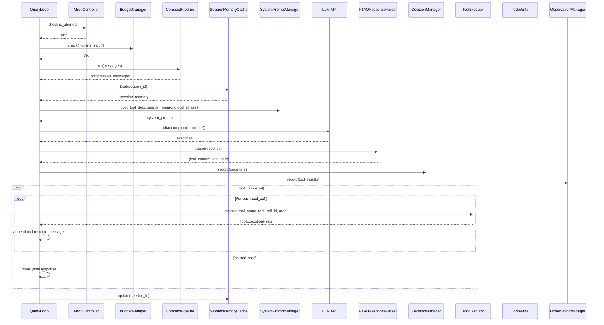
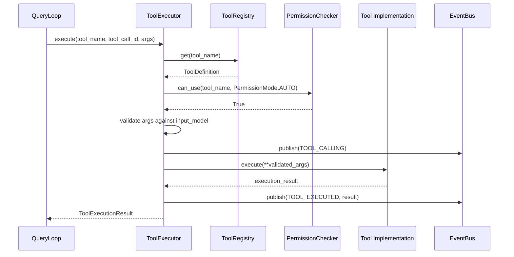
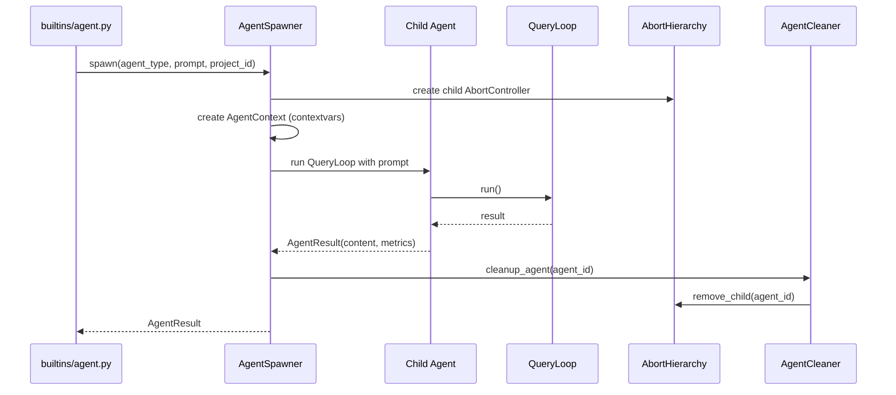
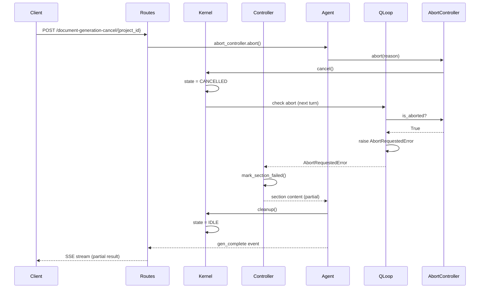
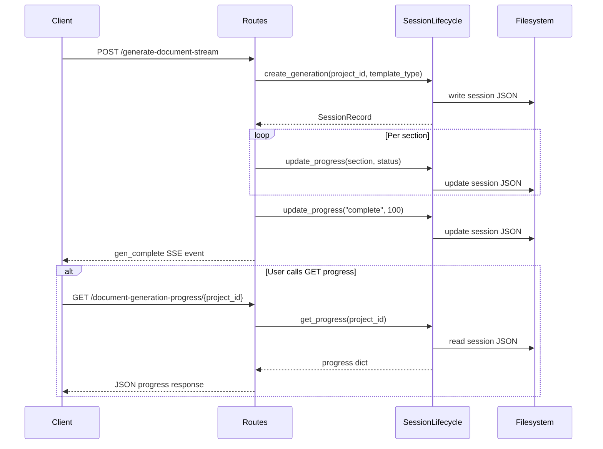
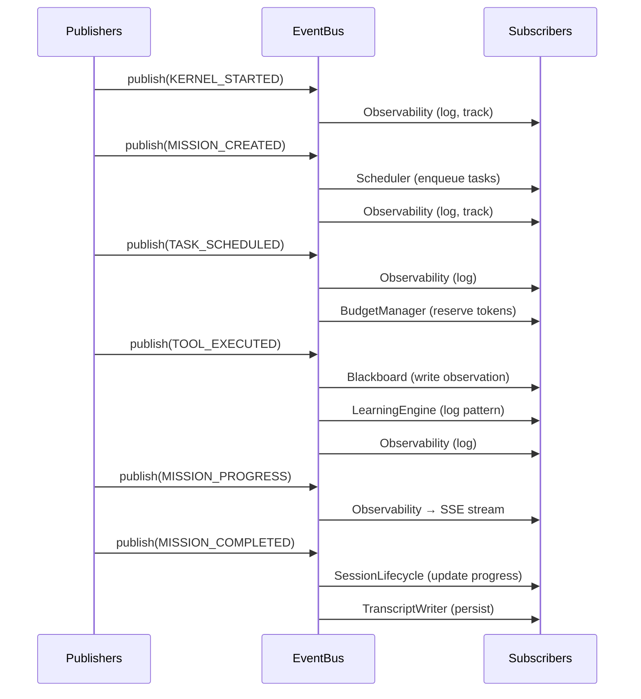

# AgentCore Sequence Diagrams

All Mermaid diagrams for AgentCore. These documents the runtime flow
for developers who need to understand how components interact.

---

## 1. Document Generation Full Flow

---

## 2. QueryLoop Inner Turn

---

## 3. Tool Execution Flow

---

## 4. Agent Spawning Flow

---

## 5. Cancellation Flow

---

## 6. Session Lifecycle

---

## 7. EventBus Communication

