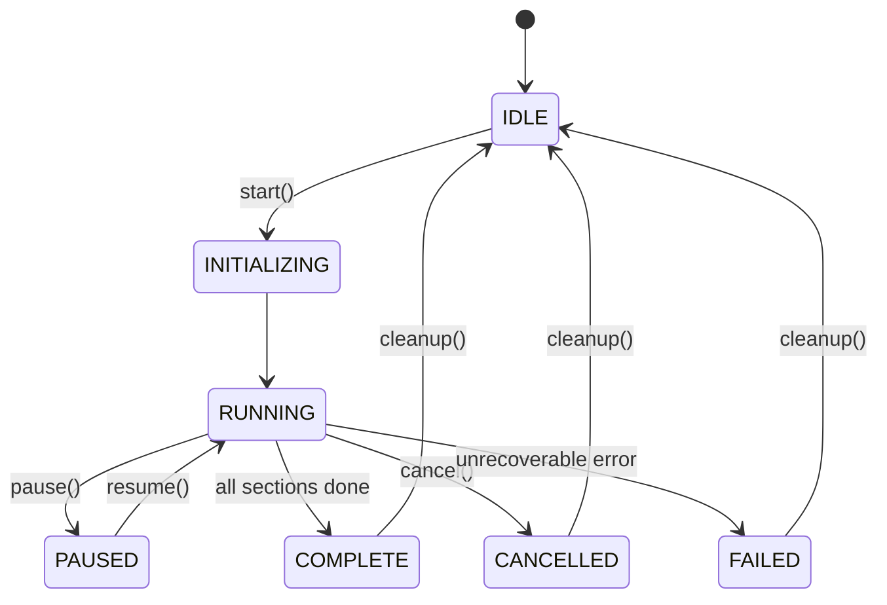
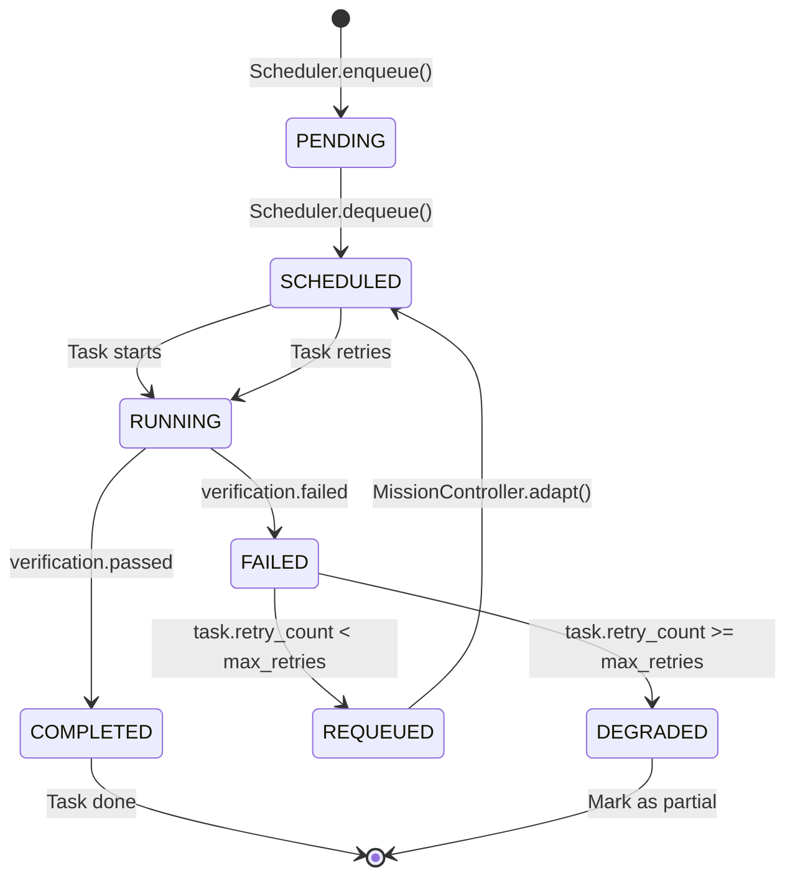
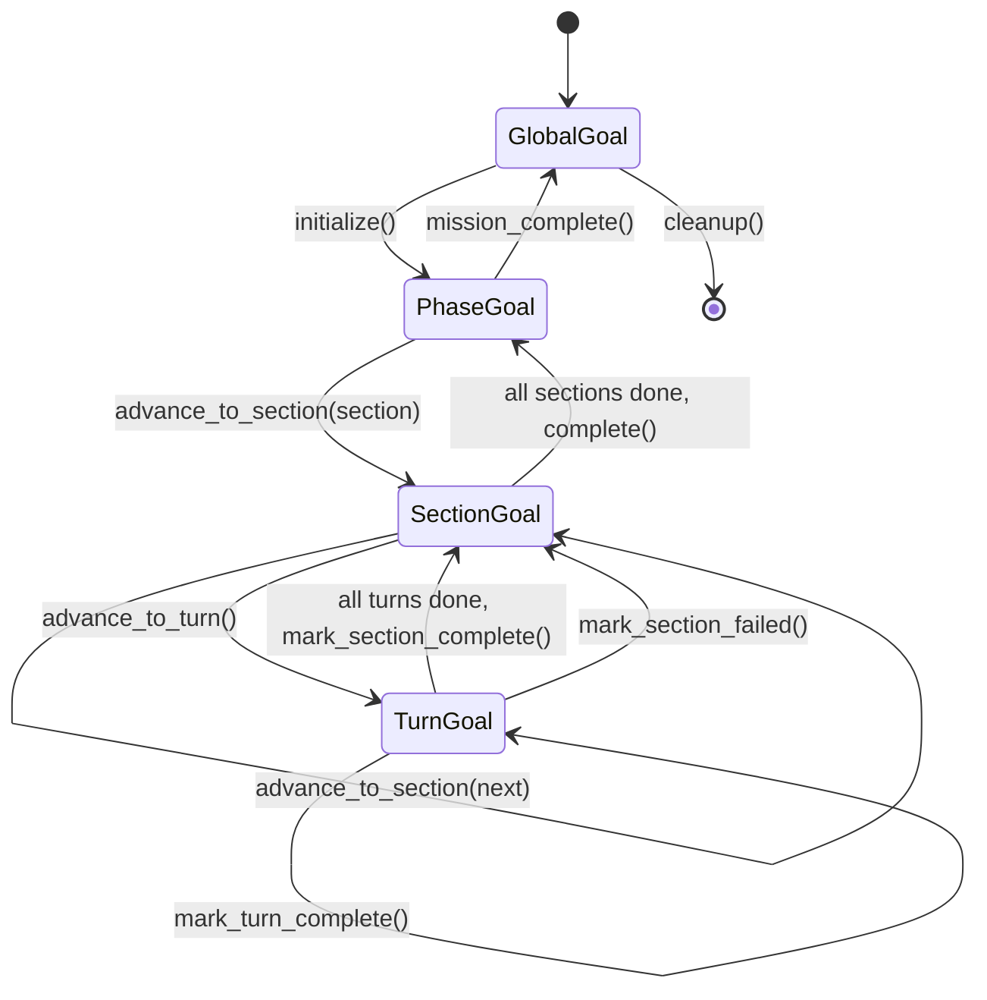
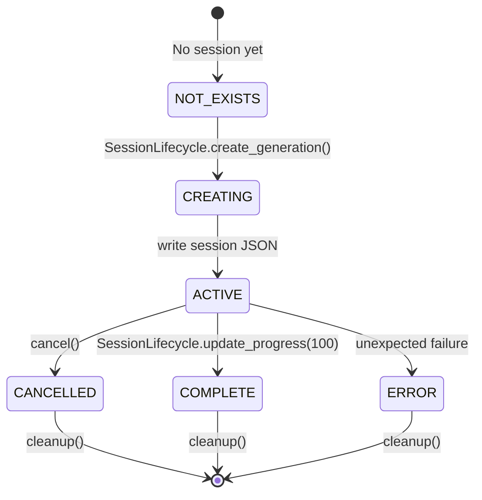
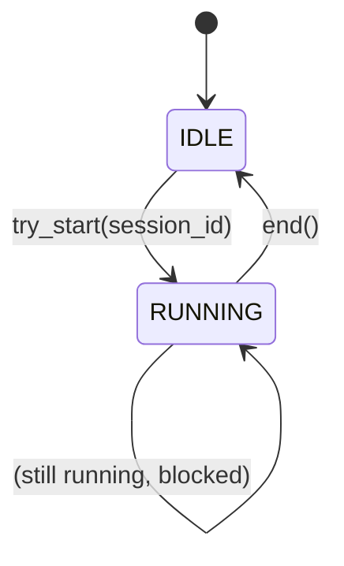
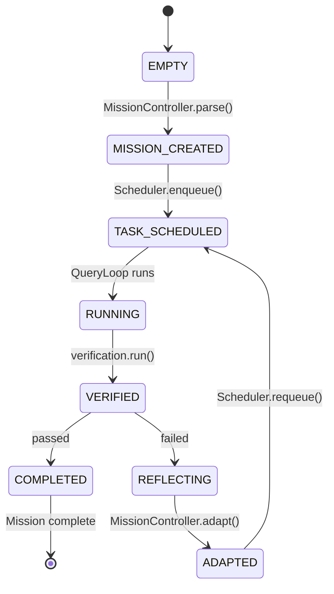
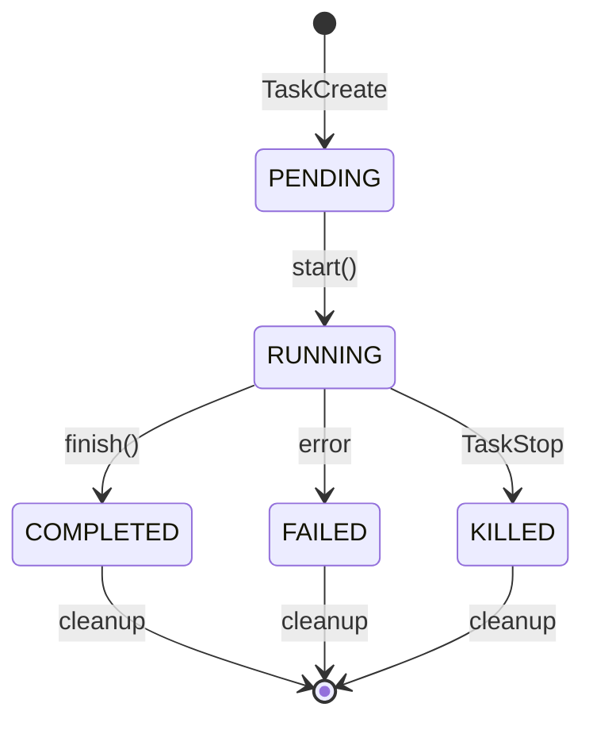

# AgentCore State Machine Diagrams

## 1. AgentKernel Lifecycle

## 2. TaskNode Lifecycle

## 3. GoalManager State Machine

## 4. SessionLifecycle State

## 5. QueryGuard State

## 6. Blackboard State

## 7. TaskState (Built-in Tool Tasks)

